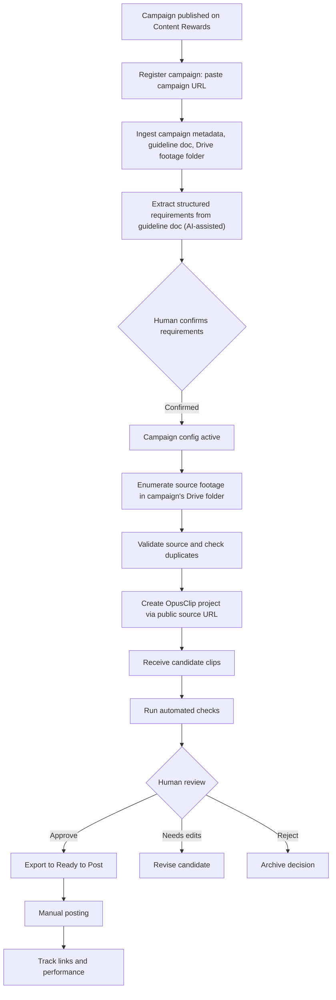
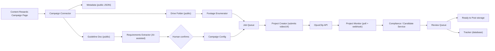

# Clip Automation Platform

A campaign-neutral system that discovers creator campaigns on Content Rewards, pulls their public brief and raw footage, and turns that footage into review-ready short-form clips using OpusClip.

The goal is simple:

> Point the system at a Content Rewards campaign → it ingests the brief and footage → generates clips → review → approve → post.

The system must remove repeated manual work — reading briefs, downloading footage, uploading it somewhere, re-typing requirements — while preserving campaign rules and requiring human approval before anything is published.

**This file is the product spec (what and why).** Before writing code, also read, in order:

1. [`docs/ARCHITECTURE.md`](docs/ARCHITECTURE.md) — module boundaries, tech stack, repo layout
2. [`docs/DATA_MODEL.md`](docs/DATA_MODEL.md) — database schema
3. [`docs/API_CONTRACTS.md`](docs/API_CONTRACTS.md) — exact request/response shapes for Content Rewards, Google Drive/Docs, and OpusClip, verified live during planning
4. [`docs/BUILD_PLAN.md`](docs/BUILD_PLAN.md) — ordered, checkable implementation tasks for Phase 1
5. [`docs/DEPLOYMENT.md`](docs/DEPLOYMENT.md) — target deployment on Render (web service, background worker, managed Postgres)

Build in the order `BUILD_PLAN.md` lays out — later tasks assume earlier ones already work.

## Local development

Requires Node 22+ and a local Postgres.

```bash
npm install
cp .env.example .env          # fill in secrets; DATABASE_URL / TEST_DATABASE_URL point at local Postgres
npm run migrate:dev           # apply migrations to DATABASE_URL
npm test                      # DB tests run against TEST_DATABASE_URL (wiped on each run) and are skipped if it's unset
npm run dev:api               # Fastify on PORT, GET /health
```

Schema changes: edit `src/db/schema.ts`, then `npm run db:generate` to produce a new migration.

## Core Principles

- **Campaign-neutral:** No game, brand, platform, caption, or watermark is hard-coded.
- **Sourced from public campaign data:** Content Rewards campaign pages, their linked guideline docs, and their linked Drive footage folders are public by design (that's how the campaign owner distributes them to clippers). The platform reads them directly — no OAuth, no impersonation, no private access is required or assumed. If a linked resource ever turns out not to be public, that's a validation failure to report, not something to work around.
- **Human approval before publishing:** Automation can create, organize, export, and prepare clips, but it must never publicly post a clip without explicit approval.
- **Configuration over code:** Campaign-specific rules belong in configuration records, not application code — including rules extracted automatically from a campaign's guideline doc.
- **AI-assisted, human-confirmed configuration:** Requirements parsed out of freeform guideline docs are a draft, not ground truth, until a human confirms them once per campaign.
- **Reliable and recoverable:** Every campaign, source video, OpusClip project, candidate clip, review decision, export, and post is tracked.
- **Idempotent:** Retrying a failed job must not create duplicate OpusClip projects or duplicate clips.
- **No unnecessary file handling:** The platform never downloads, streams, or stores full video bytes itself. OpusClip ingests directly from the public source URL.

---

## What the Platform Does



---

## Standard Workflow

### 1. Register a campaign

A user pastes a Content Rewards campaign URL (e.g. `contentrewards.com/discover/{campaign-id}`). The platform resolves the campaign ID and fetches:

- Campaign metadata (name, brand, platforms, payout structure, budget) from the discover page's public data
- The linked Google Doc guideline/brief
- The linked Google Drive folder containing raw footage and brand assets

This replaces manually creating a campaign config from scratch — the platform seeds it from the live campaign.

### 2. Extract structured requirements

Guideline docs are freeform prose, not structured data. The platform runs an AI extraction pass over the doc text to populate the same generic campaign config fields as before (aspect ratio, duration bounds, caption rules, required overlays/on-screen text, hashtags, disclosures, posting rules).

This extraction is a draft. A human reviews and confirms it once per campaign before the campaign goes active. Low-confidence fields are flagged explicitly rather than guessed silently. A campaign's config stores which fields were AI-extracted vs. human-set, and when it was confirmed.

### 3. Enumerate source footage

Instead of watching an intake folder for manually dropped files, the platform lists the files already present in the campaign's public Drive folder. Each file becomes a candidate source job the first time it's seen.

The folder is polled periodically for new files (Content Rewards campaigns add footage over time), the same way a Drive-intake watcher would in a private-upload model — just pointed at a folder the platform doesn't own.

### 4. Validate the source

Before creating anything in OpusClip:

- File is an accepted video type: MP4, MOV, or MKV
- File is not empty or corrupted (as far as metadata can tell)
- File belongs to an active, confirmed campaign
- File has not already been processed (see Duplicate prevention)
- File does not exceed OpusClip's limits (10 hours / 30 GB) or the campaign's configured limits
- The source URL is publicly reachable (pre-flight check) before it's handed to OpusClip
- Sufficient OpusClip credits are available

If validation fails, the job is marked **Needs Attention** with a clear reason. It must not silently disappear or retry forever.

### 5. Hand off to OpusClip

OpusClip's API ingests video by URL (`POST /api/clip-projects` with a `videoUrl` field), and Google Drive links are an explicitly supported source alongside YouTube, Dropbox, and S3. The platform simply submits the public Drive file link — it does not download, stream, or re-host the video itself.

This means there is no upload worker, no resumable/chunked transfer, and no local storage of source video. The only failure modes to handle here are request-level: OpusClip rejecting the URL, the request timing out, or (more likely in practice) Google Drive's anonymous-download abuse quota temporarily rejecting the fetch on a heavily-shared file. Both are treated as retryable, not permanent, failures.

### 6. Generate candidate clips

OpusClip creates one or more candidate clips from the source video, built from the campaign's confirmed config (brand template, duration bounds, aspect ratio).

For each candidate, store:

- Internal clip ID
- Campaign ID
- Source file ID (Drive file ID)
- OpusClip project ID
- OpusClip clip ID (`{project_id}.{curation_id}`)
- Title/hook
- Score and sub-scores when available
- Duration
- Aspect ratio
- Preview URL (`uriForPreview`)
- Export URL when available (`uriForExport`)
- Generated hashtags/description
- Current status

Candidate clips start in **Awaiting Review** unless the system detects a clear compliance failure.

### 7. Run automated checks

The platform checks objective requirements before presenting a clip as review-ready.

Examples:

- Correct aspect ratio
- Minimum/maximum duration
- Correct campaign template used
- Successful export
- Required caption elements generated
- Required watermark/overlay present when technically verifiable
- Required on-screen wording present when technically verifiable
- No duplicate candidate already approved from the same source moment

Checks must have one of three outcomes:

- `pass`
- `fail`
- `manual_review_required`

The system must not claim that an overlay, wording, or visual brand element is compliant unless it can verify it. Uncertain checks go to manual review.

### 8. Human review

A reviewer sees an **Awaiting Review** queue with:

- Playable preview
- Campaign
- Source video
- Candidate score
- Duration
- Proposed caption/hashtags
- Automated check results
- Requirement checklist (including which requirements were AI-extracted vs. human-confirmed)
- Notes and edit history

The reviewer can choose:

- **Approve** — create final export and move to Ready to Post
- **Needs Edit** — revise the clip or send it back for editing
- **Reject** — keep a record of the decision and reason
- **Hold** — keep it in review without further processing

Approval must be explicit and auditable.

### 9. Prepare approved clips

When approved, the platform:

1. Retrieves the HD export URL from OpusClip.
2. Saves/links the export in the platform's own `Ready to Post` storage.
3. Creates a caption file or caption record from the campaign's confirmed caption rules.
4. Updates the tracker.
5. Marks required posting fields as ready.
6. Preserves the campaign/source/project/candidate relationship.

A ready-to-post package should contain:

```text
Clip Name/
├── final.mp4
├── caption.txt
├── clip-metadata.json
└── thumbnail.jpg
```

### 10. Post manually in version one

Version one does not automatically publish to social platforms.

The user posts the approved clip manually, then records:

- TikTok URL
- Instagram Reel URL
- YouTube Short URL
- Post date
- Views
- Likes
- Engagement rate
- Earnings/reward (Content Rewards campaigns report CPM-based payout)
- Notes

Automated or scheduled publishing can be added later as a separate, explicit feature.

---

## Campaign Configuration

Campaigns are seeded from Content Rewards and confirmed by a human, then stored as data-driven records.

Example configuration:

```yaml
id: example_campaign
name: Example Campaign
status: draft # draft -> active once requirements are confirmed

source:
  content_rewards_campaign_url: https://contentrewards.com/discover/example-campaign-id
  content_rewards_campaign_id: example-campaign-id
  guideline_doc_url: https://docs.google.com/document/d/.../edit
  drive_folder_url: https://drive.google.com/drive/folders/...
  accepted_extensions:
    - mp4
    - mov
    - mkv
  max_file_size_mb: 30000 # OpusClip hard limit is 30 GB
  max_duration_hours: 10   # OpusClip hard limit

clip_generation:
  provider: opusclip
  brand_template_id: optional_template_id
  aspect_ratio: portrait
  min_duration_seconds: 10
  max_duration_seconds: 45
  original_audio_only: true
  captions_enabled: false

requirements:
  required_overlay_asset_ids: []
  required_on_screen_text: []
  required_caption_lines: []
  required_tags: []
  disclosure_lines: []
  max_additional_hashtags: 3
  extraction:
    status: pending_confirmation # pending_confirmation | confirmed
    extracted_at: null
    confirmed_by: null
    low_confidence_fields: []

review:
  required_checks:
    - visual_quality
    - campaign_branding
    - caption_compliance
  auto_approve: false

delivery:
  ready_to_post_bucket_path: r2_bucket_path
  archive_bucket_path: r2_bucket_path
  needs_attention_bucket_path: r2_bucket_path
```

Campaign configuration is where all client-specific requirements belong.

Do not create fields such as `mw4_logo`, `mw4_caption`, or `mw4_required_text` in the core application. Use generic fields such as `required_overlay_asset_ids`, `required_caption_lines`, and `required_on_screen_text`.

---

## Suggested Status Model

### Campaign statuses

```text
discovered          # URL registered, nothing fetched yet
ingesting           # pulling metadata, guideline doc, footage list
requirements_drafted
pending_confirmation
active
paused
archived
```

### Source job statuses

```text
detected
validating
validation_failed
queued
submitting            # handing videoUrl to OpusClip
submit_failed
project_created
processing
candidates_ready
needs_attention
completed
```

### Candidate clip statuses

```text
generated
checking
awaiting_review
needs_edit
approved
exporting
ready_to_post
posted
rejected
archived
```

Every status change should include:

- Timestamp
- Actor: system or user
- Reason
- Related IDs
- Error details when applicable

---

## Reliability Requirements

### Duplicate prevention

Every incoming source needs a stable identity.

Use:

- Google Drive file ID as the primary source ID
- File checksum (Drive's `md5Checksum`, reliably available for binary video files)
- Campaign ID
- Original file size and name

Before creating an OpusClip project, check whether that campaign/source combination already has an active or completed job.

A retry must continue the existing job whenever possible rather than creating a second project. Use OpusClip's project-creation idempotency support (if available) in addition to this internal check.

### Retry policy

Retry only failures likely to be temporary:

- Network timeout
- Temporary Google Drive API error
- Google Drive anonymous-download quota rejection ("too many users have viewed or downloaded this file recently")
- Temporary OpusClip API error or rate limit (30 requests/minute per key)
- Webhook delivery failure (fall back to polling `get-clips`)

Do not automatically retry:

- Unsupported file type
- Missing campaign configuration or unconfirmed requirements
- Source URL confirmed unreachable/private (not a quota issue — a real access problem)
- Insufficient credits
- Invalid source video
- Permanent authorization failure

Use exponential backoff and a maximum retry count. Send exhausted jobs to **Needs Attention**.

### Credit protection

Before starting a project:

- Atomically reserve/decrement available OpusClip credits (a read-then-act check is a race under concurrency)
- Enforce a maximum number of concurrent jobs
- Enforce a maximum source duration or file size per campaign
- Record estimated and actual credit usage (10-credit minimum per project)
- Stop gracefully when credits are insufficient

---

## Security Requirements

- Source campaign data (metadata, guideline docs, footage) is public by design — no OAuth or service-account impersonation is needed to read it, and none should be built for that purpose.
- Never attempt to reach a linked resource that turns out to require authentication — treat it as a validation failure and route to Needs Attention, not something to bypass.
- The platform's own output storage (Ready to Post, Archive, Needs Attention) and database are not public — secure them normally.
- Store all secrets (OpusClip API key, database credentials, webhook signing secret) in a secret manager or environment variables — never in source code, config files, or campaign records.
- Verify webhook payloads from OpusClip (signature or shared secret) before trusting them.
- Keep audit records for every campaign ingestion, project creation, and export.
- Do not enable social publishing credentials in the first version.

---

## Suggested Architecture



### Components

#### Campaign connector

Responsible for turning a Content Rewards campaign URL into three artifacts: metadata, guideline doc reference, footage folder reference. Resolves the campaign ID and fetches the discover page's embedded campaign data.

#### Requirements extractor

Responsible for parsing the guideline doc's freeform text into the structured campaign config fields. Flags low-confidence extractions. Produces a draft config, never an active one — a human must confirm before the campaign is used.

#### Footage enumerator

Responsible for listing files in the campaign's Drive folder and detecting new ones on subsequent polls. Replaces the private-intake Drive watcher.

#### Job queue

Responsible for reliable background processing, decoupling footage detection from project creation.

#### Project creator

Responsible for validating a source, running the pre-flight reachability check, and submitting the `videoUrl` to OpusClip's create-project endpoint. No file transfer happens here — this is a thin API call plus bookkeeping.

#### Project monitor

Responsible for checking project status and retrieving generated clips via `get-clips`. Prefers the OpusClip webhook when reliable, falls back to polling.

#### Compliance service

Responsible for objective checks, campaign rule evaluation, and creation of the review package.

#### Review interface

Responsible for showing candidates, previews, checklists, and approve/reject/edit decisions. A first version can be a simple internal page or spreadsheet-backed view; a later version can be a dedicated dashboard.

#### Tracker

Responsible for campaign, source, project, clip, review, post, and performance records. Needs real transactional guarantees (a proper database, not a spreadsheet) given the idempotency and duplicate-detection requirements above.

---

## Recommended Build Phases

### Phase 1 — Reliable ingestion and review

Build:

- Campaign connector (URL → metadata + guideline doc + Drive folder references)
- Requirements extractor with human confirmation step
- Footage enumerator (polling the campaign's Drive folder)
- Project creator (submit `videoUrl` to OpusClip, no upload worker)
- Candidate retrieval (`get-clips`, polling)
- Tracker (real database)
- Awaiting Review queue
- Manual approval
- HD export to Ready to Post
- Failure reporting and Needs Attention alerts (notify a human, don't just log)

Do not build automated social posting yet.

### Phase 2 — Better review and compliance

Build:

- Visual review dashboard
- Campaign checklists
- Caption generation from confirmed templates
- Required asset/overlay verification where possible
- Duplicate detection across exports
- OpusClip webhook integration (in addition to polling)
- Campaign performance reporting

### Phase 3 — Publishing assistance

Build:

- Posting checklist
- Platform-ready caption formatting
- Scheduled post drafts
- Performance collection
- Reuse-limit enforcement (if a campaign requires it)

### Phase 4 — Optional controlled publishing

Only after the workflow is stable:

- Connect social accounts
- Schedule approved clips
- Require explicit publish confirmation
- Log every publish action
- Support cancellation and rescheduling

---

## Non-Goals for Version One

- No automatic public posting
- No hard-coded campaign/client/game rules
- No OAuth/service-account access to campaign source data (it's public; don't build access we don't need)
- No silent retries or silent failures
- No automatic approval based only on AI scoring
- No trusting AI-extracted requirements without a human confirmation step
- No assumption that generated clips are campaign-compliant without review

---

## Initial Definition of Done

The first usable version is complete when a user can:

1. Paste a Content Rewards campaign URL.
2. Have the platform pull metadata, guideline doc, and footage folder automatically.
3. Review and confirm the AI-extracted requirements once.
4. Have the platform detect footage in the campaign's Drive folder and create exactly one job per file.
5. Have the platform hand each source off to OpusClip by URL, with no manual download/upload.
6. Receive generated candidates in an Awaiting Review queue.
7. Approve one candidate.
8. Receive an HD export, caption package, and tracker entry in Ready to Post.
9. See clear errors for every failure state.
10. Register a second campaign and have it work without changing application code.

---

## AI Build Instructions

When using AI to build this project:

- Preserve campaign neutrality.
- Do not hard-code any client, game, title, caption, platform, or watermark.
- Implement typed configuration models.
- Keep secrets in environment variables or a secret manager only.
- Use an explicit job state machine for both campaigns and source jobs.
- Make every external operation idempotent.
- Add structured logs and persistent error records.
- Design retries carefully; do not retry permanent errors (including "resource requires auth" — that's a real access problem, not a transient one).
- Treat AI-extracted campaign requirements as a draft requiring human confirmation, never as ground truth.
- Never attempt to access a campaign resource that isn't actually public — if a guideline doc or footage folder requires sign-in, that's a validation failure to surface, not a wall to climb.
- Require explicit human approval before a clip becomes Ready to Post.
- Do not add automatic social posting unless it is explicitly requested later.
- Build tests around campaign ingestion, requirements extraction/confirmation, status transitions, duplicate detection, retries, and failure recovery.
