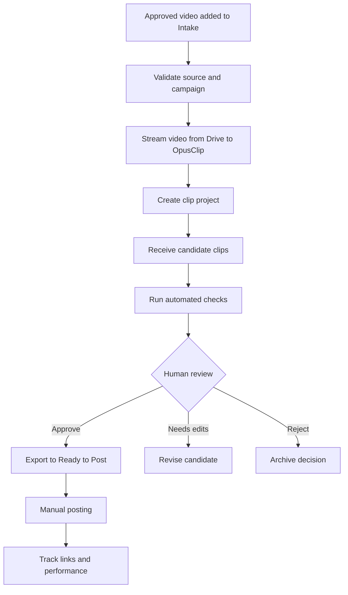
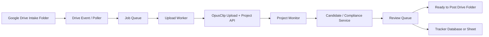

# Clip Automation Platform

A campaign-neutral system for turning approved source videos in Google Drive into review-ready short-form clips using OpusClip.

The goal is simple:

> Drop a video into an intake folder → review generated clips → approve → post.

The system must remove repeated manual downloading and uploading while keeping source footage private, preserving campaign rules, and requiring human approval before anything is published.

## Core Principles

- **Campaign-neutral:** No game, brand, platform, caption, or watermark is hard-coded.
- **Private by default:** Source videos remain private in Google Drive. The system transfers them directly to OpusClip without public Drive links.
- **Human approval before publishing:** Automation can create, organize, export, and prepare clips, but it must never publicly post a clip without explicit approval.
- **Configuration over code:** Campaign-specific rules belong in configuration files or database records.
- **Reliable and recoverable:** Every source video, upload, OpusClip project, candidate clip, review decision, export, and post is tracked.
- **Idempotent:** Retrying a failed job must not create duplicate OpusClip projects or duplicate clips.
- **Safe with large files:** Videos are streamed in resumable chunks rather than fully downloaded onto a phone, laptop, or server disk.

---

## What the Platform Does



---

## Standard Workflow

### 1. Set up a campaign

A campaign is a configuration record that defines how a set of source videos should be processed.

It may include:

- Approved Google Drive source folders
- Target platforms
- Output format and aspect ratio
- Minimum and maximum clip duration
- OpusClip brand template
- Required watermark, logo, or overlay
- Required on-screen wording
- Caption template
- Required tags, disclosures, hashtags, or links
- Audio rules
- Reuse limits
- Required review checks
- Posting rules
- Performance goals
- Keep-live duration

The platform does not know what any of these rules mean until a campaign supplies them.

### 2. Add source footage

A user places an approved video file in that campaign’s intake folder.

Example generic folder structure:

```text
Clip Automation/
├── 00 OpusClip Intake/
├── 01 Processing/
├── 02 Awaiting Review/
├── 03 Ready to Post/
├── 04 Posted Archive/
├── 05 Needs Attention/
├── 06 Campaigns/
└── 07 Brand Assets/
```

The intake folder may be shared by multiple campaigns if each file can be assigned a campaign through metadata, subfolders, or a naming convention. The simpler first version should use one intake folder per campaign.

### 3. Validate the source

Before sending anything to OpusClip, the system validates:

- File is an accepted video type: MP4, MOV, or MKV
- File is not empty or corrupted
- File belongs to an active campaign
- File has not already been processed
- File does not exceed configured size or duration limits
- Sufficient OpusClip credits are available
- Required campaign assets and templates exist

If validation fails, the job is marked **Needs Attention** with a clear reason. It must not silently disappear or retry forever.

### 4. Upload without manual downloading

The automation reads the private source file from Google Drive and streams it directly to an OpusClip signed upload destination.

Requirements:

- Do not require public Drive links.
- Do not require manual phone or laptop downloads.
- Do not load the entire file into memory.
- Use resumable, chunked upload behavior.
- Persist upload progress so a temporary connection failure can resume safely.
- Record the Drive file ID, file name, size, checksum when available, and upload ID.

After upload completes, the platform creates an OpusClip project using the campaign’s configuration.

### 5. Generate candidate clips

OpusClip creates one or more candidate clips from the source video.

For each candidate, store:

- Internal clip ID
- Campaign ID
- Source file ID
- OpusClip project ID
- OpusClip clip ID
- Title/hook
- Score and sub-scores when available
- Duration
- Aspect ratio
- Preview URL
- Thumbnail URL
- Generated description/caption data
- Current status
- Export URL when available

Candidate clips start in **Awaiting Review** unless the system detects a clear compliance failure.

### 6. Run automated checks

The platform checks objective requirements before presenting a clip as review-ready.

Examples:

- Correct aspect ratio
- Minimum/maximum duration
- Correct campaign template used
- Successful export
- Required caption elements generated
- Required watermark/overlay present when technically verifiable
- Required on-screen wording present when technically verifiable
- Audio rule applied
- Reuse limit not exceeded
- No duplicate candidate already approved from the same moment

Checks must have one of three outcomes:

- `pass`
- `fail`
- `manual_review_required`

The system must not claim that an overlay, wording, or visual brand element is compliant unless it can verify it. Uncertain checks go to manual review.

### 7. Human review

A reviewer sees an **Awaiting Review** queue with:

- Playable preview
- Thumbnail
- Campaign
- Source video
- Candidate score
- Duration
- Proposed caption
- Automated check results
- Required review checklist
- Notes and edit history

The reviewer can choose:

- **Approve** — create final export and move to Ready to Post
- **Needs Edit** — revise the clip or send it back for editing
- **Reject** — keep a record of the decision and reason
- **Hold** — keep it in review without further processing

Approval must be explicit and auditable.

### 8. Prepare approved clips

When approved, the platform:

1. Exports the HD final clip.
2. Saves or links the export in `03 Ready to Post`.
3. Creates a caption file or caption record.
4. Updates the tracker.
5. Marks required posting fields as ready.
6. Preserves the source/project/candidate relationship.

A ready-to-post package should contain:

```text
Clip Name/
├── final.mp4
├── caption.txt
├── clip-metadata.json
└── thumbnail.jpg
```

### 9. Post manually in version one

Version one does not automatically publish to social platforms.

The user posts the approved clip manually, then records:

- TikTok URL
- Instagram Reel URL
- YouTube Short URL
- Post date
- Keep-live date
- Views
- Likes
- Engagement rate
- Earnings or reward
- Notes

Automated or scheduled publishing can be added later as a separate, explicit feature.

---

## Campaign Configuration

Campaigns must be data-driven.

Example configuration:

```yaml
id: example_campaign
name: Example Campaign
status: active

source:
  intake_folder_id: google_drive_folder_id
  approved_source_folder_ids:
    - google_drive_folder_id
  accepted_extensions:
    - mp4
    - mov
    - mkv
  max_file_size_mb: 3000

clip_generation:
  provider: opusclip
  brand_template_id: optional_template_id
  aspect_ratio: portrait
  min_duration_seconds: 10
  max_duration_seconds: 45
  original_audio_only: true
  captions_enabled: false

requirements:
  required_overlay_asset_ids: []
  required_on_screen_text: []
  required_caption_lines: []
  required_tags: []
  disclosure_lines: []
  max_additional_hashtags: 3
  max_reuses_per_export: 5
  keep_live_days: 30

review:
  required_checks:
    - visual_quality
    - campaign_branding
    - caption_compliance
    - audio_compliance
  auto_approve: false

delivery:
  ready_to_post_folder_id: google_drive_folder_id
  archive_folder_id: google_drive_folder_id
  needs_attention_folder_id: google_drive_folder_id
```

Campaign configuration is where all client-specific requirements belong.

Do not create fields such as `mw4_logo`, `mw4_caption`, or `mw4_required_text` in the core application. Use generic fields such as `required_overlay_asset_ids`, `required_caption_lines`, and `required_on_screen_text`.

---

## Suggested Status Model

### Source job statuses

```text
detected
validating
validation_failed
queued
uploading
upload_failed
uploaded
project_creating
project_created
processing
candidates_ready
needs_attention
completed
```

### Candidate clip statuses

```text
generated
checking
awaiting_review
needs_edit
approved
exporting
ready_to_post
posted
rejected
archived
```

Every status change should include:

- Timestamp
- Actor: system or user
- Reason
- Related IDs
- Error details when applicable

---

## Reliability Requirements

### Duplicate prevention

Every incoming source needs a stable identity.

Use:

- Google Drive file ID as the primary source ID
- File checksum when available
- Campaign ID
- Original file size
- Original file name

Before creating an OpusClip project, check whether that campaign/source combination already has an active or completed job.

A retry must continue the existing job whenever possible rather than creating a second project.

### Retry policy

Retry only failures likely to be temporary:

- Network timeout
- Temporary Google Drive API error
- Temporary OpusClip API error
- Resumable upload interruption
- Rate limit response

Do not automatically retry:

- Unsupported file type
- Missing campaign configuration
- Missing required assets
- Insufficient credits
- Invalid source video
- Permanent authorization failure

Use exponential backoff and a maximum retry count. Send exhausted jobs to **Needs Attention**.

### Large-file handling

Videos may be multiple gigabytes.

The upload worker must:

- Stream from Drive rather than download the entire file first
- Upload to OpusClip using resumable/chunked upload behavior
- Persist upload session state
- Avoid holding complete video data in memory
- Handle temporary interruption without restarting from zero when possible

### Credit protection

Before starting a project:

- Check available OpusClip credits
- Enforce a maximum number of concurrent jobs
- Enforce a maximum source duration or file size per campaign
- Record estimated and actual credit usage when available
- Stop gracefully when credits are insufficient

---

## Security Requirements

- Keep source videos private in Google Drive.
- Do not require “anyone with the link” access for normal automation.
- Use OAuth/service credentials with the minimum required Drive permissions.
- Store all secrets in a secret manager.
- Never store API keys, access tokens, or refresh tokens in source code, Google Sheets, or campaign configuration files.
- Use short-lived access tokens where possible.
- Limit the automation identity to required Drive folders.
- Keep audit records for every external upload and export.
- Do not enable social publishing credentials in the first version.

---

## Suggested Architecture



### Components

#### Drive watcher

Responsible for detecting new files in campaign intake folders.

Preferred behavior:

- Use Drive event notifications where available
- Fall back to periodic polling if needed
- Ignore unsupported files
- Avoid processing partially uploaded files
- Create one source job per new file

#### Job queue

Responsible for reliable background processing.

The queue separates file detection from uploading so an incoming video does not fail just because the upload worker is temporarily unavailable.

#### Upload worker

Responsible for:

- Reading the source from Drive
- Creating an OpusClip upload session
- Resumably streaming the file to the signed destination
- Creating the OpusClip project
- Persisting IDs and error details

#### Project monitor

Responsible for checking project status and retrieving generated clips when processing completes.

#### Compliance service

Responsible for objective checks, campaign rule evaluation, and creation of the review package.

#### Review interface

Responsible for showing candidates, previews, checklists, and approve/reject/edit decisions.

A first version can use a Google Sheet plus OpusClip previews. A later version can use a dedicated web dashboard.

#### Tracker

Responsible for source, project, clip, review, post, and performance records.

A Google Sheet can work for the first version. A database is better once volume, multiple users, retries, and reporting become important.

---

## Recommended Build Phases

### Phase 1 — Reliable intake and review

Build:

- Campaign configuration
- Google Drive intake watcher
- Private Drive-to-OpusClip upload worker
- OpusClip project creation
- Candidate retrieval
- Tracker records
- Awaiting Review queue
- Manual approval
- HD export to Ready to Post
- Failure reporting

Do not build automated social posting yet.

### Phase 2 — Better review and compliance

Build:

- Visual review dashboard
- Campaign checklists
- Caption generation from approved templates
- Required asset/overlay verification where possible
- Duplicate detection across exports
- Better notifications
- Campaign performance reporting

### Phase 3 — Publishing assistance

Build:

- Posting checklist
- Platform-ready caption formatting
- Scheduled post drafts
- Keep-live reminders
- Performance collection
- Reuse-limit enforcement

### Phase 4 — Optional controlled publishing

Only after the workflow is stable:

- Connect social accounts
- Schedule approved clips
- Require explicit publish confirmation
- Log every publish action
- Support cancellation and rescheduling

---

## Non-Goals for Version One

- No automatic public posting
- No hard-coded campaign/client/game rules
- No public Drive sharing requirement
- No manual downloading/uploading for normal intake
- No silent retries or silent failures
- No automatic approval based only on AI scoring
- No assumption that generated clips are campaign-compliant without review

---

## Initial Definition of Done

The first usable version is complete when a user can:

1. Create a campaign configuration.
2. Drop a private approved MP4 into that campaign’s intake folder.
3. Have the platform detect it and create exactly one job.
4. Have the platform stream it to OpusClip without manual download/upload.
5. Receive generated candidates in an Awaiting Review queue.
6. Approve one candidate.
7. Receive an HD export, caption package, and tracker entry in Ready to Post.
8. See clear errors for every failure state.
9. Process a second campaign with different rules without changing application code.

---

## AI Build Instructions

When using AI to build this project:

- Preserve campaign neutrality.
- Do not hard-code any client, game, title, caption, platform, or watermark.
- Implement typed configuration models.
- Keep secrets in environment variables or a secret manager only.
- Use an explicit job state machine.
- Make every external operation idempotent.
- Add structured logs and persistent error records.
- Design retries carefully; do not retry permanent errors.
- Never make source Drive files public as part of normal operation.
- Require explicit human approval before a clip becomes Ready to Post.
- Do not add automatic social posting unless it is explicitly requested later.
- Build tests around campaign configuration, status transitions, duplicate detection, retries, and failure recovery.
