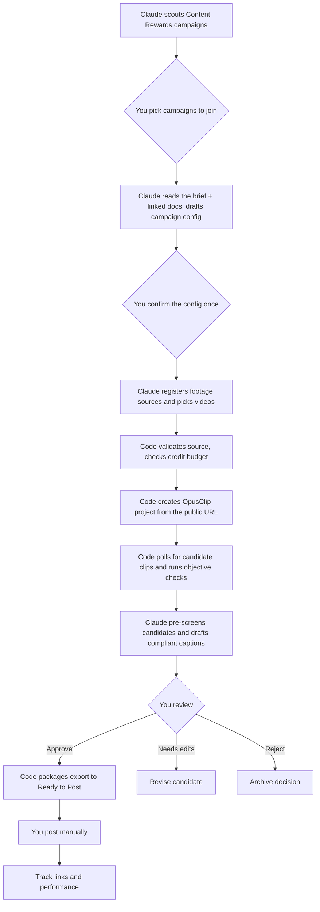

# Clip Automation Platform

A campaign-neutral system that finds creator campaigns on Content Rewards that it can actually serve, reads their briefs, finds the campaign's long-form footage wherever it's hosted, and turns it into review-ready short-form clips with OpusClip.

The goal is simple:

> Pick a Content Rewards campaign → Claude reads the brief and finds the footage → OpusClip generates clips → Claude pre-screens and drafts captions → you approve → you post.

It's run by a **Claude operator**, a scheduled Claude Code session that follows a playbook (`.claude/skills/clipper-operator/`). Claude does the reading and judgment; a small `clipper` CLI and database do everything that must be exact, idempotent or safe. You keep every decision that commits to a campaign, spends credits beyond the budget, or publishes.

**This file is the product spec (what and why).** Before writing code, also read, in order:

1. [`docs/CAMPAIGN_SURVEY.md`](docs/CAMPAIGN_SURVEY.md): what real Content Rewards campaigns look like, and the evidence behind the design
2. [`docs/ARCHITECTURE.md`](docs/ARCHITECTURE.md): the code / Claude / human split, guardrails, CLI contract, footage source kinds
3. [`docs/DATA_MODEL.md`](docs/DATA_MODEL.md): database schema, including planned v2 changes
4. [`docs/API_CONTRACTS.md`](docs/API_CONTRACTS.md): Content Rewards (verified live), Google Docs/Drive, OpusClip
5. [`docs/BUILD_PLAN.md`](docs/BUILD_PLAN.md): ordered, checkable implementation tasks for Phase 1
6. [`docs/DEPLOYMENT.md`](docs/DEPLOYMENT.md): Render hosting
7. [`.claude/skills/clipper-operator/SKILL.md`](.claude/skills/clipper-operator/SKILL.md): the operator playbook Claude follows

Build in the order `BUILD_PLAN.md` lays out; later tasks assume earlier ones already work.

## Local development

Requires Node 22+ and a local Postgres.

```bash
npm install
cp .env.example .env          # fill in secrets; DATABASE_URL / TEST_DATABASE_URL point at local Postgres
npm run migrate:dev           # apply migrations to DATABASE_URL
npm test                      # DB tests run against TEST_DATABASE_URL (wiped on each run) and are skipped if it's unset
npm run dev:api               # Fastify on PORT, GET /health
```

Schema changes: edit `src/db/schema.ts`, then `npm run db:generate` to produce a new migration.

## Core Principles

- **Campaign-neutral:** No game, brand, platform, caption, or watermark is hard-coded.
- **Sourced from public campaign data:** Content Rewards campaign pages, their guideline docs, and the footage they link to (Drive, YouTube, Dropbox, Frame.io and more) are public by design; that's how campaign owners distribute them to clippers. The platform reads them anonymously: no OAuth, no impersonation, no private access. If a linked resource turns out not to be public, that's a Needs Attention item for a person, never something to work around.
- **Claude for judgment, code for guarantees:** Reading briefs, picking footage, and pre-screening clips are Claude's job, following the operator playbook. Dedupe, credit limits, caption requirement checks, and the approval gate are enforced in code so a playbook mistake can't cause harm.
- **Only campaigns the pipeline can serve:** About 60% of campaigns are long-form → clips work that OpusClip fits. UGC, music-audio and slideshow campaigns are identified during scouting and not onboarded.
- **Human approval before publishing:** Automation can create, organize, export, and prepare clips, but it must never publicly post a clip without explicit approval.
- **Configuration over code:** Campaign-specific rules belong in configuration records, not application code — including rules extracted automatically from a campaign's guideline doc.
- **Claude-drafted, human-confirmed configuration:** Requirements Claude reads out of freeform briefs are a draft, not ground truth, until a human confirms them once per campaign.
- **Reliable and recoverable:** Every campaign, source video, OpusClip project, candidate clip, review decision, export, and post is tracked.
- **Idempotent:** Retrying a failed job must not create duplicate OpusClip projects or duplicate clips.
- **No unnecessary file handling:** The platform never downloads, streams, or stores full video bytes itself. OpusClip ingests directly from the public source URL.

---

## What the Platform Does



---

## Standard Workflow

### 1. Scout and pick campaigns

Claude reads the Content Rewards discover listing and each promising campaign's brief, classifies it (long-form → clips, UGC, music, slideshow, unclear), and recommends a short ranked list of long-form campaigns with what each needs from you: join, apply, dedicated page. You join on Content Rewards; that's an account action and stays with a person. Then `clipper campaign add <url>` tracks the campaign.

### 2. Read the brief and draft requirements

Briefs are freeform and spread out: a Google Doc, sub-docs it links to, and the campaign page's reference materials. Claude reads all of it and writes a structured campaign config (duration, aspect ratio, exact caption phrases, required tags, disclosures, hashtag limits), marking each field high or low confidence and listing what the brief doesn't say. It also notes rules the config can't express, like dedicated-page or audience-tier requirements.

This is a draft. You review and confirm it once per campaign in the review web app before the campaign goes active.

### 3. Find and select footage

Footage links sit in the campaign's reference materials and inside the brief. They point to Drive folders, YouTube channels, Dropbox, Frame.io, files uploaded to Content Rewards, and sometimes hosts OpusClip can't read (Kick, MediaSilo, custom portals). Claude registers the footage locations, then uses `clipper footage list-url` to see what's inside and picks what to process:

- In mixed folders it picks raw footage (`Raw to edit`, `Un-Edited Clips`, full episodes) over b-roll, finished edits, logos and stills.
- On YouTube channels it applies the brief's content filter ("only videos with 1win merch").
- Every select **and** skip is recorded with a reason, so later runs only look at new files.

Unsupported hosts become a Needs Attention item for you.

### 4. Validate the source

Before creating anything in OpusClip, code checks:

- The host is one OpusClip ingests, and the URL is publicly reachable
- The file isn't already processed for this campaign (dedupe on a stable source key such as the Drive file ID or YouTube video ID)
- Size/duration are within OpusClip limits (10 hours / 30 GB) and the campaign's limits
- The campaign is active and confirmed
- The daily and per-campaign credit budgets allow it

If validation fails, the job goes to **Needs Attention** with a clear reason. It never silently disappears or retries forever.

### 5. Hand off to OpusClip

OpusClip's API ingests video by URL (`POST /api/clip-projects` with `videoUrl`) from YouTube, Google Drive, Dropbox, Frame.io, Loom, Vimeo, Twitch and public S3 MP4 links. The platform submits the public link; it never downloads, streams or re-hosts source video.

The only failure modes are request-level: OpusClip rejecting the URL, a timeout, or a host temporarily throttling a heavily-shared file (Google Drive's anonymous-download quota). Throttling and timeouts are retried; a rejected URL is not.

### 6. Generate candidate clips

OpusClip creates one or more candidate clips from the source video, built from the campaign's confirmed config (brand template, duration bounds, aspect ratio).

For each candidate, store:

- Internal clip ID
- Campaign ID
- Source key (e.g. `gdrive:{fileId}`, `youtube:{videoId}`)
- OpusClip project ID
- OpusClip clip ID (`{project_id}.{curation_id}`)
- Title/hook
- Score and sub-scores when available
- Duration
- Aspect ratio
- Preview URL (`uriForPreview`)
- Export URL when available (`uriForExport`)
- Generated hashtags/description
- Current status

Candidate clips start in **Awaiting Review** unless the system detects a clear compliance failure.

### 7. Run automated checks

The platform checks objective requirements before presenting a clip as review-ready.

Examples:

- Correct aspect ratio
- Minimum/maximum duration
- Correct campaign template used
- Successful export
- Required caption elements generated
- Required watermark/overlay present when technically verifiable
- Required on-screen wording present when technically verifiable
- No duplicate candidate already approved from the same source moment

Checks must have one of three outcomes:

- `pass`
- `fail`
- `manual_review_required`

The system must not claim that an overlay, wording, or visual brand element is compliant unless it can verify it. Uncertain checks go to manual review.

### 8. Human review

A reviewer sees an **Awaiting Review** queue with:

- Playable preview
- Campaign
- Source video
- Candidate score
- Duration
- Proposed caption/hashtags
- Automated check results
- Claude's pre-screen verdict and notes (advisory)
- Claude's caption draft, already validated against the required phrases, tags and disclosures
- Requirement checklist (including which requirements were Claude-drafted vs. human-confirmed)
- Notes and edit history

The reviewer can choose:

- **Approve** — create final export and move to Ready to Post
- **Needs Edit** — revise the clip or send it back for editing
- **Reject** — keep a record of the decision and reason
- **Hold** — keep it in review without further processing

Approval must be explicit and auditable.

### 9. Prepare approved clips

When approved, the platform:

1. Retrieves the HD export URL from OpusClip.
2. Saves/links the export in the platform's own `Ready to Post` storage.
3. Creates a caption file or caption record from the campaign's confirmed caption rules.
4. Updates the tracker.
5. Marks required posting fields as ready.
6. Preserves the campaign/source/project/candidate relationship.

A ready-to-post package should contain:

```text
Clip Name/
├── final.mp4
├── caption.txt
├── clip-metadata.json
└── thumbnail.jpg
```

### 10. Post manually in version one

Version one does not automatically publish to social platforms.

The user posts the approved clip manually, then records:

- TikTok URL
- Instagram Reel URL
- YouTube Short URL
- Post date
- Views
- Likes
- Engagement rate
- Earnings/reward (Content Rewards campaigns report CPM-based payout)
- Notes

Automated or scheduled publishing can be added later as a separate, explicit feature.

---

## Campaign Configuration

Campaigns are seeded from Content Rewards and confirmed by a human, then stored as data-driven records.

Example configuration:

```yaml
id: example_campaign
name: Example Campaign
status: draft # draft -> active once requirements are confirmed

source:
  content_rewards_campaign_url: https://contentrewards.com/discover/example-campaign-id
  content_rewards_campaign_id: example-campaign-id
  campaign_type: lf   # lf | ugc | music | slideshow | unclear; only lf is onboarded
  guideline_doc_url: https://docs.google.com/document/d/.../edit
  footage_sources:    # registered by Claude, each with a reason
    - kind: gdrive_folder
      url: https://drive.google.com/drive/folders/...
      label: Raw to edit, full podcast episodes
    - kind: youtube_channel
      url: https://www.youtube.com/@creator
      label: Only videos with sponsor merch (brief rule)
  max_file_size_mb: 30000 # OpusClip hard limit is 30 GB
  max_duration_hours: 10   # OpusClip hard limit

clip_generation:
  provider: opusclip
  brand_template_id: optional_template_id
  aspect_ratio: portrait
  min_duration_seconds: 10
  max_duration_seconds: 45
  original_audio_only: true
  captions_enabled: false

requirements:
  required_overlay_asset_ids: []
  required_on_screen_text: []
  required_caption_lines: []
  required_tags: []
  disclosure_lines: []
  max_additional_hashtags: 3
  extraction:
    status: pending_confirmation # pending_confirmation | confirmed
    extracted_at: null
    confirmed_by: null
    low_confidence_fields: []

review:
  required_checks:
    - visual_quality
    - campaign_branding
    - caption_compliance
  auto_approve: false

delivery:
  ready_to_post_bucket_path: r2_bucket_path
  archive_bucket_path: r2_bucket_path
  needs_attention_bucket_path: r2_bucket_path
```

Campaign configuration is where all client-specific requirements belong.

Do not create fields such as `mw4_logo`, `mw4_caption`, or `mw4_required_text` in the core application. Use generic fields such as `required_overlay_asset_ids`, `required_caption_lines`, and `required_on_screen_text`.

---

## Suggested Status Model

### Campaign statuses

```text
discovered          # URL registered, nothing fetched yet
ingesting           # pulling metadata, guideline doc, footage list
requirements_drafted
pending_confirmation
active
paused
archived
```

### Source job statuses

```text
detected
validating
validation_failed
queued
submitting            # handing videoUrl to OpusClip
submit_failed
project_created
processing
candidates_ready
needs_attention
completed
```

### Candidate clip statuses

```text
generated
checking
awaiting_review
needs_edit
approved
exporting
ready_to_post
posted
rejected
archived
```

Every status change should include:

- Timestamp
- Actor: system or user
- Reason
- Related IDs
- Error details when applicable

---

## Reliability Requirements

### Duplicate prevention

Every incoming source needs a stable identity.

Use:

- A source key that is stable across however the file was found: `gdrive:{fileId}`, `youtube:{videoId}`, or a hash of the share URL for other hosts
- File checksum where the host exposes one (Drive's `md5Checksum`)
- Campaign ID
- Original file size and name

Before creating an OpusClip project, check whether that campaign/source combination already has an active or completed job.

A retry must continue the existing job whenever possible rather than creating a second project. Use OpusClip's project-creation idempotency support (if available) in addition to this internal check.

### Retry policy

Retry only failures likely to be temporary:

- Network timeout
- Temporary footage-host error (Drive, YouTube, Dropbox listing)
- Google Drive anonymous-download quota rejection ("too many users have viewed or downloaded this file recently")
- Temporary OpusClip API error or rate limit (30 requests/minute per key)
- Webhook delivery failure (fall back to polling `get-clips`)

Do not automatically retry:

- Unsupported file type
- Missing campaign configuration or unconfirmed requirements
- Source URL confirmed unreachable/private (not a quota issue — a real access problem)
- Insufficient credits
- Invalid source video
- Permanent authorization failure

Use exponential backoff and a maximum retry count. Send exhausted jobs to **Needs Attention**.

### Credit protection

Before starting a project:

- Atomically reserve/decrement available OpusClip credits (a read-then-act check is a race under concurrency)
- Enforce a maximum number of concurrent jobs
- Enforce a maximum source duration or file size per campaign
- Record estimated and actual credit usage (10-credit minimum per project)
- Stop gracefully when credits are insufficient

---

## Security Requirements

- Source campaign data (metadata, guideline docs, footage) is public by design — no OAuth or service-account impersonation is needed to read it, and none should be built for that purpose.
- Never attempt to reach a linked resource that turns out to require authentication — treat it as a validation failure and route to Needs Attention, not something to bypass.
- The platform's own output storage (Ready to Post, Archive, Needs Attention) and database are not public — secure them normally.
- Store all secrets (OpusClip API key, database credentials, webhook signing secret) in a secret manager or environment variables — never in source code, config files, or campaign records.
- Verify webhook payloads from OpusClip (signature or shared secret) before trusting them.
- Keep audit records for every campaign ingestion, project creation, and export.
- Do not enable social publishing credentials in the first version.

---

## Architecture

See [`docs/ARCHITECTURE.md`](docs/ARCHITECTURE.md). In short:

- **Code** (`clipper` CLI + Postgres + a Render cron running `clipper sync`): Content Rewards parsing, footage listing, OpusClip submit/poll with idempotency and a credit budget, objective checks, caption validation, packaging to R2, notifications, the audit log.
- **Claude operator** (Claude Code Routine following `.claude/skills/clipper-operator/`): scouting, brief reading, config drafting, footage selection, candidate pre-screen, caption drafting, Needs Attention triage.
- **You** (review web app): join campaigns, confirm configs, approve clips, post, record results.

---

## Recommended Build Phases

### Phase 1 — Operator loop, ingestion and review

The ordered task list is in [`docs/BUILD_PLAN.md`](docs/BUILD_PLAN.md): the `clipper` CLI, brief reading, footage sources, OpusClip submit/sync with a credit budget, caption validation, the review web app, packaging, notifications, and the operator Routine.

Do not build automated social posting yet.

### Phase 2 — Better review and compliance

Build:

- Visual review dashboard
- Campaign checklists
- Caption generation from confirmed templates
- Required asset/overlay verification where possible
- Duplicate detection across exports
- OpusClip webhook integration (in addition to polling)
- Campaign performance reporting

### Phase 3 — Publishing assistance

Build:

- Posting checklist
- Platform-ready caption formatting
- Scheduled post drafts
- Performance collection
- Reuse-limit enforcement (if a campaign requires it)

### Phase 4 — Optional controlled publishing

Only after the workflow is stable:

- Connect social accounts
- Schedule approved clips
- Require explicit publish confirmation
- Log every publish action
- Support cancellation and rescheduling

---

## Non-Goals for Version One

- No automatic public posting
- No hard-coded campaign/client/game rules
- No OAuth/service-account access to campaign source data (it's public; don't build access we don't need)
- No onboarding of UGC, music-audio or slideshow campaigns (OpusClip doesn't fit them)
- No Claude path to approving clips, activating campaigns, joining campaigns or posting
- No silent retries or silent failures
- No automatic approval based only on AI scoring
- No trusting AI-extracted requirements without a human confirmation step
- No assumption that generated clips are campaign-compliant without review

---

## Initial Definition of Done

The first usable version is complete when:

1. Claude scouts Content Rewards and recommends long-form campaigns, with UGC/music/slideshow ones filtered out.
2. After you add one, Claude reads its brief (including linked docs) and proposes a config.
3. You confirm the config once in the review web app.
4. Claude registers the campaign's footage and selects videos with recorded reasons, whether the footage is in a Drive folder, on a YouTube channel, or elsewhere.
5. Code submits each selected video to OpusClip by URL, exactly once, within the credit budget.
6. Candidates arrive in the review queue with objective checks, Claude's pre-screen, and a validated caption draft.
7. You approve one candidate.
8. An HD export, caption file and tracker entry land in Ready to Post.
9. Every failure shows up as a clear Needs Attention item, and the operator's run report tells you what needs you.
10. A second campaign on a different footage host works without changing application code.

---

## AI Build Instructions

When using AI to build this project:

- Preserve campaign neutrality.
- Do not hard-code any client, game, title, caption, platform, or watermark.
- Implement typed configuration models.
- Keep secrets in environment variables or a secret manager only.
- Use an explicit job state machine for both campaigns and source jobs.
- Make every external operation idempotent.
- Add structured logs and persistent error records.
- Design retries carefully; do not retry permanent errors (including "resource requires auth" — that's a real access problem, not a transient one).
- Treat AI-extracted campaign requirements as a draft requiring human confirmation, never as ground truth.
- Never attempt to access a campaign resource that isn't actually public — if a guideline doc or footage folder requires sign-in, that's a validation failure to surface, not a wall to climb.
- Require explicit human approval before a clip becomes Ready to Post.
- Do not add automatic social posting unless it is explicitly requested later.
- Put judgment in the operator playbook and guarantees in code. When a new step needs reading or deciding, extend `.claude/skills/clipper-operator/`; when it must be exact or safe, add a `clipper` CLI command and enforce it there. Never give the CLI a command that approves, activates or posts.
- Build tests around campaign ingestion, requirements extraction/confirmation, status transitions, duplicate detection, retries, and failure recovery.
