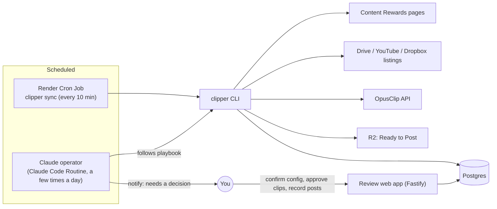

# Architecture

`README.md` is the product spec (what and why). This document is the how. It was revised on 2026-09-22 after the campaign survey (`CAMPAIGN_SURVEY.md`) showed that the hard parts of this workflow are judgment calls, not plumbing. Which campaigns are worth doing? Which of eight subfolders is the raw footage? Which YouTube videos have the sponsor's merch in them? Does this caption follow the brief?

## The split: code guards the state, Claude does the reading, people make the decisions

The platform is run by a **Claude operator**: a scheduled Claude Code session that follows the playbook in `.claude/skills/clipper-operator/`. It uses a small **`clipper` CLI** for every read and write. Code is kept for work that must be exact, repeatable or safe. Claude handles work that means reading messy, human-written material and deciding what it means. People keep every decision that spends money in public, commits to a campaign, or publishes.

| Concern | Owner | Why |
|---|---|---|
| Database, status machine, dedupe | **Code** | Must be transactional and idempotent. Enforced by DB constraints (already built). |
| Content Rewards page parsing | **Code** (`campaign-connector`) | Deterministic. Already built and tested. |
| Listing Drive folders, YouTube feeds | **Code** | Mechanical HTTP. Returns names and IDs for Claude to choose from. |
| OpusClip submit / poll / export | **Code** | Costs credits. Needs idempotency, a credit budget and rate limiting. |
| Approval of clips | **Code + human** | The approval endpoint only accepts a signed-in human. **The CLI has no approve command.** |
| Export packaging to R2, notifications | **Code** | Mechanical. |
| Scouting: which campaigns fit | **Claude** → human picks | Classifying LF vs UGC/music/slideshow means reading briefs. |
| Brief → structured campaign config | **Claude** → human confirms | Briefs are freeform prose spread across docs, Notion pages and sub-docs. |
| Footage selection (folders, videos) | **Claude** | Choosing between `Raw to edit` / `B-rolls` / `Memes Only`, or "videos with 1win merch". |
| Candidate pre-screen + caption drafts | **Claude** → human approves | Judgment against the brief. Code then verifies required phrases, tags and disclosures are present. |
| Needs Attention triage | **Claude** → human if stuck | Reads the error and proposes the fix or the question for a person. |
| Joining/applying to a campaign, posting | **Human only** | Account actions on third-party platforms. Never automated in v1. |

This replaces the earlier plan, which put every step in code and added a separate LLM-call module (`requirements-extractor`). That approach would have meant hard-coding folder-picking rules and brief parsing that the survey showed vary with every campaign.

## Runtime shape



- **`clipper sync`**: deterministic and cheap, run by a Render Cron Job. It polls OpusClip for submitted projects, upserts candidates, runs objective checks, packages approved clips to R2, and sends notifications. No LLM involved.
- **Claude operator run**: judgment work, run as a Claude Code Routine against this repo a few times a day, or on demand. It works through the playbook's loop (scout → onboard → source footage → submit → pre-screen → triage) and ends with a short report.
- **Review web app**: the one human-facing surface. Confirm campaign configs, approve/reject clips, record post URLs. It replaces the planned `review-api` and is served by the existing Fastify app.

The Render Background Worker and `pg-boss` queue from the earlier plan are dropped. The cron job plus DB status columns cover the queueing a workload this size needs, with no long-running process.

## Guardrails (enforced in code, not by the playbook)

The playbook tells Claude what to do. These invariants make sure a mistake in following it can't cause harm:

1. **No approval path in the CLI.** Candidates reach `approved` only through the web app's authenticated endpoint. Nothing Claude can run changes that.
2. **`autoApprove` is rejected** by config validation if it is ever anything but `false`.
3. **Campaigns reach `active` only through human confirmation** in the web app. `clipper campaign propose-config` writes a draft (`pending_confirmation`) and cannot activate.
4. **Credit budget.** `clipper source submit` refuses to go over `OPUSCLIP_DAILY_CREDIT_BUDGET` or the per-campaign cap. The check is atomic in the DB.
5. **Idempotent submit.** A `(campaign_id, source_key)` pair can create at most one OpusClip project (unique constraint plus a `submitting` lock state).
6. **Public sources only.** Listing and submit commands fetch anonymously. A sign-in wall becomes a `needs_attention` reason, never an auth attempt.
7. **Caption validation.** `clipper candidate set-caption` rejects a caption that's missing any of the campaign's required phrases, tags or disclosures. Claude drafts, code verifies.
8. **Every write is audited.** Each CLI mutation writes a `status_events` row with `actor = 'claude-operator'` (or the human's ID from the web app).

## `clipper` CLI contract

Every command prints JSON to stdout so the playbook can act on it. Exit code is non-zero on failure, with `{ "error": { "code", "message" } }`. Commands marked (r) are read-only.

```
# Campaigns
clipper campaign scout                          (r) list discover campaigns + parsed metadata, not yet tracked
clipper campaign add <contentRewardsUrl>            track a campaign (status: discovered); runs campaign-connector
clipper campaign show <id>                      (r) campaign row + config + footage sources + counts
clipper campaign list [--status s]              (r)
clipper campaign brief <id> [--doc <url>]       (r) guideline doc text + every hyperlink in it (HTML export), plus referenceMaterials; --doc reads a linked sub-doc
clipper campaign classify <id> --type <lf|ugc|music|slideshow|unclear> --reason "..."
clipper campaign propose-config <id> --file config.json   validate (zod) + store draft; status → pending_confirmation
clipper campaign flag <id> --reason "..."           status → needs_attention + notify

# Footage
clipper footage list-url <url>                  (r) expand a Drive folder (recursive), YouTube channel feed, or single file into entries {sourceKey, kind, name, url, path, sizeBytes?, publishedAt?}
clipper footage add <campaignId> --url <url> [--label "..."] --reason "..."   register a footage source (folder, channel or file)
clipper footage select <campaignId> --source-key <k> --reason "..."          mark one video for processing → source_job (detected)
clipper footage skip <campaignId> --source-key <k> --reason "..."            record a deliberate skip so it isn't re-evaluated

# Processing
clipper source validate <sourceJobId>               checks: supported host, public reachability, size/duration limits
clipper source submit <sourceJobId>                 credit check + idempotent OpusClip create-project
clipper source list [--status s] [--campaign id]  (r)
clipper credits                                 (r) budget used/remaining today and per campaign

# Candidates
clipper candidate list [--status s] [--campaign id]  (r) includes OpusClip title/description/hashtags/score + check results
clipper candidate prescreen <id> --verdict <recommend|hold|reject> --notes "..."   advisory only; never approves
clipper candidate set-caption <id> --file caption.txt   validated against campaign requirements

# Operations
clipper sync                                        the deterministic loop (also run by cron)
clipper attention list                          (r) everything in needs_attention with reasons
clipper notify --message "..."                      send a message to the human via NOTIFY_WEBHOOK_URL
```

## Footage source kinds

`source_key` is the dedupe identity of one video, independent of how it was found.

| Kind | Example URL | Listing | `source_key` | OpusClip `videoUrl` |
|---|---|---|---|---|
| `gdrive_folder` | `drive.google.com/drive/folders/{id}` | `embeddedfolderview?id=` (keyless, recursive). Drive API v3 + key as a fallback | per file: `gdrive:{fileId}` | `drive.google.com/file/d/{fileId}/view` |
| `gdrive_file` | `drive.google.com/file/d/{id}/view` | — | `gdrive:{fileId}` | as given |
| `youtube_channel` | `youtube.com/@handle` | resolve channel ID from page → `feeds/videos.xml?channel_id=` (15 most recent) | per video: `youtube:{videoId}` | `youtube.com/watch?v={videoId}` |
| `youtube_video` | `youtube.com/watch?v=`, `youtu.be/`, `/shorts/` | — | `youtube:{videoId}` | canonical watch URL |
| `s3_mp4` | Content Rewards `publicassetsbucket` video refs | from `referenceMaterials` (`type: video`) | `s3:{sha1(url)}` | as given |
| `dropbox` | `dropbox.com/scl/fo/...`, `/scl/fi/...` | file links direct. Folder listing TBD (see Build Plan) | `dropbox:{sha1(url)}` | as given |
| `frameio`, `loom`, `vimeo`, `twitch` | share links | — | `{kind}:{sha1(url)}` | as given |
| `unsupported` | Kick, MediaSilo, Notion, custom sites | — | — | → campaign `needs_attention` with the link, for a human |

## Code layout

```
src/
  config.ts                 env loading + validation (built)
  app.ts, server.ts         Fastify: /health (built), review web app (to build)
  db/                       schema, migrations, client (built)
  cli/                      `clipper` entrypoint + one file per command group
  modules/
    campaign-connector/     Content Rewards URL → metadata (built)
    brief-reader/           guideline doc text + hyperlinks (HTML export), following Google Docs sub-links one level
    footage-sources/        URL → kind classification; Drive folder / YouTube feed listing
    opusclip/               typed client: create project, get clips, credit/budget guard
    compliance/             objective checks + caption requirement validation
    packaging/              Ready-to-Post bundle → R2
    notifier/               webhook delivery
.claude/
  skills/clipper-operator/  the playbook Claude follows (SKILL.md + one file per procedure)
```

Modules talk to each other through their exported functions, not each other's tables. The CLI and the web app are thin layers over the modules. Each is a separate entry point into the same code, so there is only one implementation of each rule.

## Tech stack

| Concern | Choice | Status |
|---|---|---|
| Runtime | TypeScript on Node 22 | built |
| HTTP | Fastify | built (`/health`) |
| Database | Postgres (Render managed), Drizzle migrations | built |
| Validation | zod | built |
| CLI | plain `node` entry with a small arg parser (no framework needed) | to build |
| Operator | Claude Code Routine on this repo, with `DATABASE_URL`, `OPUSCLIP_API_KEY`, `NOTIFY_WEBHOOK_URL` in the environment | to set up |
| Scheduled sync | Render Cron Job running `clipper sync` | to build |
| Storage | Cloudflare R2 | to build |

`ANTHROPIC_API_KEY` is no longer an app dependency: the app code makes no LLM calls. Claude's work happens in the operator session.
