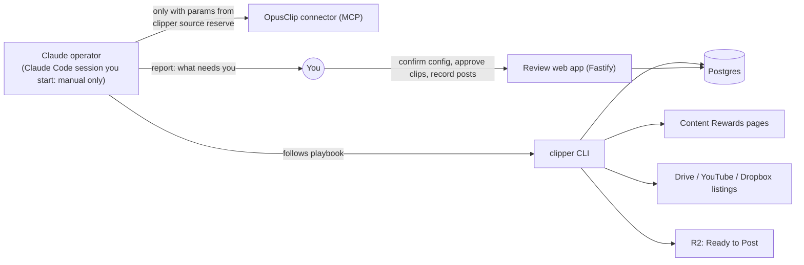

# Architecture

`README.md` is the product spec (what and why). This document is the how. It was revised on 2026-09-22 after the campaign survey (`CAMPAIGN_SURVEY.md`) showed that the hard parts of this workflow are judgment calls, not plumbing. Which campaigns are worth doing? Which of eight subfolders is the raw footage? Which YouTube videos have the sponsor's merch in them? Does this caption follow the brief?

## The split: code guards the state, Claude does the reading, people make the decisions

The platform is run by a **Claude operator**: a Claude Code session that **a person starts on demand** (never on a schedule) and that follows the playbook in `.claude/skills/clipper-operator/`. It uses a small **`clipper` CLI** for every read and write of our own state, and the **OpusClip connector** (MCP) to submit videos and work with clips. Code is kept for work that must be exact, repeatable or safe. Claude handles work that means reading messy, human-written material and deciding what it means. People keep every decision that spends money in public, commits to a campaign, or publishes.

| Concern | Owner | Why |
|---|---|---|
| Database, status machine, dedupe | **Code** | Must be transactional and idempotent. Enforced by DB constraints (already built). |
| Content Rewards page parsing | **Code** (`campaign-connector`) | Deterministic. Already built and tested. |
| Listing Drive folders, YouTube feeds | **Code** | Mechanical HTTP. Returns names and IDs for Claude to choose from. |
| Permission to spend OpusClip credits | **Code** (`clipper source reserve`) | Dedupe and budget are checked in the DB *before* Claude may submit. See "OpusClip via the connector" below. |
| OpusClip submit / list clips / transcript / export | **Claude via the OpusClip connector** | The connector does the API work. Claude only calls it with parameters the CLI handed out, and records every result back through the CLI. |
| Approval of clips | **Code + human** | The approval endpoint only accepts a signed-in human. **The CLI has no approve command.** |
| Export packaging to R2, notifications | **Code** | Mechanical. |
| Scouting: which campaigns fit | **Claude** → human picks | Classifying LF vs UGC/music/slideshow means reading briefs. |
| Brief → structured campaign config | **Claude** → human confirms | Briefs are freeform prose spread across docs, Notion pages and sub-docs. |
| Footage selection (folders, videos) | **Claude** | Choosing between `Raw to edit` / `B-rolls` / `Memes Only`, or "videos with 1win merch". |
| Candidate pre-screen + caption drafts | **Claude** → human approves | Judgment against the brief, using the clip's **transcript** from the connector. Code then verifies required phrases, tags and disclosures are present. |
| Clip fixes (cut a phrase, fix a caption typo, trim) | **Claude via connector**, only when a reviewer asked | Recorded through the CLI, and the clip goes back to review. |
| Needs Attention triage | **Claude** → human if stuck | Reads the error and proposes the fix or the question for a person. |
| Joining/applying to a campaign, posting | **Human only** | Account actions on third-party platforms. Never automated in v1. |

This replaces the earlier plan, which put every step in code and added a separate LLM-call module (`requirements-extractor`). That approach would have meant hard-coding folder-picking rules and brief parsing that the survey showed vary with every campaign.

## Runtime shape



- **Claude operator run**: a Claude Code session on this repo that you start ("do an operator run"). There is no scheduled Routine; that's a deliberate decision (2026-09-23). It works through the playbook's loop: triage → collect finished clips → pre-screen → package approved clips → source footage → submit → onboard → scout. It ends with a short report. Because the OpusClip connector is only available inside a Claude session, the operator run also does the polling a cron job would otherwise do.
- **Review web app**: the one human-facing surface. Confirm campaign configs, approve/reject clips, record post URLs. Served by the existing Fastify app.

In a cloud session, the CLI runs in **remote mode**: Claude's cloud sessions can only make HTTPS requests, so each `clipper` command is sent to the review app's `POST /operator/run` and runs there through the same code, as `claude-operator`, under a separate `OPERATOR_TOKEN` (see `DEPLOYMENT.md`). Locally, the CLI talks to Postgres directly.

There is no background worker, cron job or scheduled run: nothing happens unless you start a run or act on the review page. Because OpusClip takes minutes to hours per video, a run that submits footage usually can't collect its clips; a later run you start does.

**If you ever want automation:** Pro also includes the plain OpusClip API, so a `clipper sync` Render Cron Job could poll with `OPUSCLIP_API_KEY` and write through the same CLI functions, and a scheduled Claude Routine could run the playbook. Both are deliberately **not** part of v1.

## OpusClip via the connector: record first, then spend

The connector can spend credits the moment Claude calls `opusclip_submit_project`, and code can't intercept a connector call. So the protocol makes the database the gate, and the connector call only follows a green light from it:

1. **Reserve.** `clipper source reserve <jobId> --opus-remaining <n> [--range <startSec>-<endSec>] [--estimated-minutes <m>]`. In one transaction, the CLI checks:
   - the job is `queued`, its campaign is `active`, and it has no project and no open reservation;
   - the estimate fits the daily and per-campaign budgets in `credit_ledger`, **and** fits `--opus-remaining`, the figure Claude just read from `opusclip_get_usage`.

   If everything passes, it inserts the reservation, moves the job to `submitting`, and returns `submitParams`: the exact `videoUrl`, `aspectRatio`, `brandTemplateId`, `clipDurationsSec`, `rangeStart`/`rangeEnd`, and `title: "clipper:<jobId>"`.
2. **Submit.** Claude calls `opusclip_submit_project` with exactly `submitParams`, nothing added or changed.
3. **Record.** `clipper source record-project <jobId> --project-id <id>` moves the job to `project_created`. On a connector error, `clipper source record-failure <jobId> --error '<message>'` classifies it (retryable or permanent), releases the reservation, and sets the status.

**Crash recovery.** A job left in `submitting` means step 2 may or may not have happened. Before anything else touches it, Claude looks in `opusclip_list_projects` for a project titled `clipper:<jobId>`. If found, it records that project; if not, it records the failure. Claude never resubmits a `submitting` job without that check. This, plus the `clipper:<jobId>` title, is what keeps "never create two projects for one video" true across crashes.

**Estimating cost.** OpusClip charges about 1 credit per minute of source video (per `opusclip_get_usage`), and only the submitted range is billed. When the duration is unknown (Drive and YouTube listings don't give it), `reserve` holds a conservative default (`DEFAULT_ESTIMATE_MINUTES`, 90) unless a `--range` or `--estimated-minutes` is given. `clipper credits reconcile --opus-used <n>` records the actual usage figure after each run, so the ledger tracks reality.

**The order is enforced, not trusted.** A `PreToolUse` hook in `.claude/settings.json` runs before every `opusclip_submit_project` call (`.claude/hooks/guard-opusclip-submit.sh` → `clipper guard submit`). It reads the call's parameters and allows it only if the title is `clipper:<jobId>`, that job is `submitting` with an open reservation, and every parameter equals the `submitParams` issued for it. Anything else is blocked before OpusClip sees it. Until the guard command exists (BUILD_PLAN task 8), the hook blocks **every** submission, so nothing can spend credits outside the protocol.

**Tools Claude may not call.** The connector also exposes posting (`opusclip_create_post_task`, `opusclip_schedule_publish`, `opusclip_unschedule_publish`) and public sharing (`opusclip_share_project`). OpusClip gates these behind an approval link in its own app, but v1 doesn't post through OpusClip at all, so they are **denied in `.claude/settings.json`**. That's a harness-level block, not a playbook rule.

## Guardrails (enforced in code, not by the playbook)

The playbook tells Claude what to do. These invariants make sure a mistake in following it can't cause harm:

1. **No approval path for automation.** Candidates reach `approved` (and `needs_edit`, `rejected`, `posted`) and campaigns reach `active` only with a `reviewer:<identity>` actor. `transition()` refuses those moves for any other actor, and only the web app's authenticated endpoints act as a reviewer. The CLI also simply has no such command.
2. **`autoApprove` is rejected** by config validation if it is ever anything but `false`.
3. **Campaigns reach `active` only through human confirmation** in the web app. `clipper campaign propose-config` writes a draft (`pending_confirmation`) and cannot activate.
4. **Credit budget.** `clipper source reserve` refuses anything over `OPUSCLIP_DAILY_CREDIT_BUDGET`, the per-campaign cap, or OpusClip's own remaining monthly credits. The check and reservation are one DB transaction. (OpusClip reports its monthly cap as not enforced, so ours is the one that holds.)
5. **One project per video, and no submit without a reservation.** A `(campaign_id, source_key)` pair has one job; a job can hold one open reservation and one project. The submit hook blocks any connector submission that doesn't match an open reservation exactly. Submissions are titled `clipper:<jobId>` so a crash can be reconciled against OpusClip instead of resubmitting.
6. **No posting or sharing tools.** OpusClip's post, schedule and share tools are denied in `.claude/settings.json`.
7. **Public sources only.** Listing and submit commands fetch anonymously. A sign-in wall becomes a `needs_attention` reason, never an auth attempt.
8. **Caption validation.** `clipper candidate set-caption` rejects a caption that's missing any of the campaign's required phrases, tags or disclosures. Claude drafts, code verifies.
9. **Every write is audited.** Status changes write `status_events` (via `transition()`); other writes (classify, add footage, captions, …) write `audit_log` in the same transaction. CLI writes are attributed to `claude-operator`, web-app writes to `reviewer:<identity>`.

## `clipper` CLI contract

Run as `npx clipper <group> <command>` from the repo (`bin/clipper` runs the TypeScript source via tsx, so there's no stale build). Every command prints JSON to stdout so the playbook can act on it. Exit code is non-zero on failure, with `{ "error": { "code", "message" } }`; codes include `usage`, `invalid_argument`, `not_found`, `invalid_transition`, `human_only`, `config`, and the connector's `invalid_url` / `fetch_failed` / `parse_failed`. Commands marked (r) are read-only. `clipper help` lists everything. Campaign arguments accept our ID, the Content Rewards campaign ID, or its URL.

```
# Campaigns
clipper campaign scout [--all]                  (r) discover-page campaigns (rate/1K, budget, platforms, description, application); untracked only unless --all
clipper campaign add <contentRewardsUrl>            track a campaign (status: discovered); runs campaign-connector
clipper campaign show <id>                      (r) campaign row + config + footage sources + counts
clipper campaign list [--status s]              (r)
clipper campaign brief <id> [--doc <url>]       (r) guideline doc text + every hyperlink in it (HTML export), plus referenceMaterials; --doc reads a linked sub-doc
clipper campaign classify <id> --type <lf|ugc|music|slideshow|unclear> --reason "..."
clipper campaign propose-config <id> --file config.json   validate (zod) + store draft; status → pending_confirmation
clipper campaign flag <id> --reason "..."           status → needs_attention (announced by `attention notify`)

# Footage
clipper footage list-url <url> [--campaign <id>] (r) expand a Drive folder (recursive, with folder paths), YouTube channel (15 most recent uploads, Shorts flagged) or file link into
                                                    entries {sourceKey, kind, name, url, path, isVideo, mimeType?, isShort?, publishedAt?, description?, views?};
                                                    with --campaign, each entry carries its recorded decision and `undecidedVideos` counts new ones
clipper footage add <campaignId> --url <url> --reason "..." [--label "..."]   register a footage source (folder, channel or file); idempotent per URL
clipper footage select <campaignId> --url <videoUrl> --reason "..." [--name n] [--path p] [--from <sourceUrl>]   → source_job (detected); idempotent
clipper footage skip <campaignId> --url <videoUrl> --reason "..." [...]        record a deliberate skip (status skipped) so it isn't re-evaluated
clipper footage list <campaignId> [--decision selected|skipped]               (r) registered sources and every decision with its reason

# Processing (OpusClip calls themselves go through the connector; see "record first, then spend")
clipper source validate <sourceJobId>               checks: campaign confirmed + active, source publicly reachable (Drive: no sign-in redirect; YouTube: oEmbed) → queued
clipper source reserve <sourceJobId> --opus-remaining <n> [--range a-b] [--estimated-minutes m]
                                                    budget + dedupe check, reserve credits → submitting; returns submitParams
clipper source record-project <sourceJobId> --project-id <id>     → project_created
clipper source record-failure <sourceJobId> --error "..."          classify, release reservation, set status
clipper source list [--status s] [--campaign id]  (r)
clipper credits                                 (r) budget used/remaining today, per campaign, and last reconciled OpusClip usage
clipper credits reconcile --opus-used <n> --limit <n> --reset-at <iso>   record opusclip_get_usage's monthly figures
clipper guard submit                                (hook) read a PreToolUse payload on stdin; exit 0 only if it matches an open reservation, else exit 2

# Candidates
clipper candidate upsert <sourceJobId> --file clips.json   store opusclip_list_clips output (deduped by clip id), run objective checks → awaiting_review
clipper candidate list [--status s] [--campaign id] [--job id]  (r) includes OpusClip title/description/hashtags/score + check results
clipper candidate record-edit <id> --ops-file ops.json --reason "..."   log a connector edit; candidate → awaiting_review again
clipper candidate record-export <id> --url <exportUrl>   store the HD export URL from opusclip_export_clip (approved candidates only)
clipper candidate prescreen <id> --verdict <recommend|hold|reject> --notes "..."   advisory only; never approves
clipper candidate set-caption <id> --file caption.txt   validated against campaign requirements

# Operations
clipper package <candidateId>                       approved + export URL recorded → R2 bundle → ready_to_post (refuses anything not approved by a human)
clipper attention list                          (r) jobs/campaigns needing triage + configs waiting for confirmation, with reasons
clipper attention notify                            one digest of items not yet announced for their current status (+ configs waiting > 24h)
clipper notify --message "..."                      send a message to the human via NOTIFY_WEBHOOK_URL (Slack or Discord webhook)
```

## Footage source kinds

`source_key` is the dedupe identity of one video, independent of how it was found.

| Kind | Example URL | Listing | `source_key` | OpusClip `videoUrl` |
|---|---|---|---|---|
| `gdrive_folder` | `drive.google.com/drive/folders/{id}` | `embeddedfolderview?id=` (keyless, recursive). Drive API v3 + key as a fallback | per file: `gdrive:{fileId}` | `drive.google.com/file/d/{fileId}/view` |
| `gdrive_file` | `drive.google.com/file/d/{id}/view` | — | `gdrive:{fileId}` | as given |
| `youtube_channel` | `youtube.com/@handle` | resolve channel ID from page → `feeds/videos.xml?channel_id=` (15 most recent) | per video: `youtube:{videoId}` | `youtube.com/watch?v={videoId}` |
| `youtube_video` | `youtube.com/watch?v=`, `youtu.be/`, `/shorts/` | — | `youtube:{videoId}` | canonical watch URL |
| `s3_mp4` | Content Rewards `publicassetsbucket` video refs | from `referenceMaterials` (`type: video`) | `s3:{sha1(url)}` | as given |
| `dropbox` | `dropbox.com/scl/fo/...`, `/scl/fi/...` | file links direct. Folders **can't be listed** (the page renders client-side): a person supplies file links | `dropbox:{sha1(url without dl=)}` | as given, minus `dl=` |
| `frameio`, `loom`, `vimeo`, `twitch` | share links | — | `{kind}:{sha1(url)}` | as given |
| `unsupported` | Kick, MediaSilo, Notion, custom sites | — | — | → campaign `needs_attention` with the link, for a human |
| `opus_upload` | a file a person supplies for an unsupported host | — | `upload:{sha1(file)}` | `opusclip_create_upload_link` → upload → `upload_id` (a person does the upload in v1) |

## Code layout

```
src/
  config.ts                 env loading + validation (built)
  app.ts, server.ts         Fastify: /health (built), review web app (to build)
  db/                       schema, migrations, client (built)
  cli/                      `clipper` entrypoint + one file per command group
  modules/
    campaign-connector/     Content Rewards URL → metadata (built)
    brief-reader/           guideline doc text + hyperlinks (HTML export), following Google Docs sub-links one level
    footage-sources/        URL → kind classification; Drive folder / YouTube feed listing
    credits/                credit ledger: reserve / release / reconcile, budget checks
    compliance/             objective checks + caption requirement validation (pure functions)
    candidates/             opusclip_list_clips parsing, candidate upsert, pre-screen, captions, edit log
    review/                 human-only decisions: confirm/pause campaigns, approve/needs-edit/reject/hold, record posts
  web/                      review web app: reviewer sign-in (auth.ts), escaped HTML (html.ts), pages + forms (routes.ts)
    packaging/              Ready-to-Post bundle → R2 (streamed; r2.ts is the S3-API adapter)
    notifier/               webhook delivery (Slack / Discord)
    attention/              what needs a person, and the once-per-status-change notification digest
.claude/
  skills/clipper-operator/  the playbook Claude follows (SKILL.md + one file per procedure)
```

Modules talk to each other through their exported functions, not each other's tables. The CLI and the web app are thin layers over the modules. Each is a separate entry point into the same code, so there is only one implementation of each rule.

## Tech stack

| Concern | Choice | Status |
|---|---|---|
| Runtime | TypeScript on Node 22 | built |
| HTTP | Fastify | built (`/health` + review web app, server-rendered, no client JS) |
| Database | Postgres (Supabase free, via the Session pooler with TLS verified against Supabase's CA), Drizzle migrations | built |
| Validation | zod | built |
| CLI | plain `node` entry with a small arg parser (no framework needed) | to build |
| Operator | A Claude Code session you start on this repo, with the OpusClip connector attached; in the cloud it reaches the DB via the review app (`CLIPPER_OPERATOR_TOKEN`) | manual only, no schedule |
| OpusClip | OpusClip connector (MCP), Pro plan: 900 credits/month, 10 concurrent projects (checked 2026-09-22) | connected |
| Storage | Cloudflare R2 via `@aws-sdk/client-s3` + `lib-storage` (streaming multipart) | built; bucket not created yet |

`ANTHROPIC_API_KEY` and `OPUSCLIP_API_KEY` are no longer app dependencies. The app makes no LLM calls and doesn't call OpusClip; both happen in the operator session.
