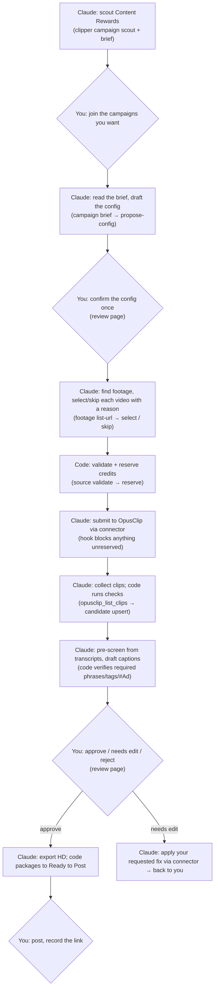

# Roadmap & Status

**Start here.** This page says where the project is going, how the whole process will work when it's done, and exactly where it stands today. It's the summary; the detail lives in the docs it links to.

*Last updated: 2026-09-23 · tasks 0–10 built; live checks for 8–9 pending*

---

## 1. The goal

Automate short-form clipping for [Content Rewards](https://contentrewards.com/discover) campaigns using Claude and OpusClip. A person stays in charge of the few decisions that commit money or publish.

> Claude finds campaigns worth doing → reads each brief → finds the footage → OpusClip makes clips → Claude pre-screens them and drafts captions → **you approve** → **you post**.

## 2. The direction, and why

The first plan (Sept 17) was a conventional app: every step in code, footage assumed to be in a Google Drive folder, and the app calling an LLM to parse briefs. A survey of all 50 live campaigns (Sept 22, [`CAMPAIGN_SURVEY.md`](CAMPAIGN_SURVEY.md)) showed that doesn't fit reality:

- **Only ~60% of campaigns are "clip this footage" work** (31 of 50). The rest are UGC, music-audio or photo-slideshow campaigns that OpusClip can't do.
- **Footage is scattered:** Drive folders (20 campaigns), YouTube channels (7), Dropbox (4), Content Rewards uploads, Frame.io, and hosts OpusClip can't read (Kick, MediaSilo, custom portals).
- **The hard parts are judgment:** which of 8 subfolders is raw footage and which is logos or memes; which YouTube videos show the sponsor's merch; whether a caption follows the brief.

So the design became **code for guarantees, Claude for judgment, people for decisions** ([`ARCHITECTURE.md`](ARCHITECTURE.md)):

| Who | Does what | How |
|---|---|---|
| **Code** | Anything that must be exact or safe: the database, dedupe, credit budget, caption rule checks, the approval gate, the audit log | The `clipper` CLI + Postgres |
| **Claude** | Reading and deciding: scouting campaigns, turning briefs into configs, picking footage, pre-screening clips, drafting captions, triaging problems | A scheduled Claude Code session following the playbook in [`.claude/skills/clipper-operator/`](../.claude/skills/clipper-operator/SKILL.md), acting only through the CLI and the **OpusClip connector** |
| **You** | Joining campaigns, confirming each campaign's config once, approving clips, posting | Content Rewards, and the review web page (not built yet) |

OpusClip is reached through its **connector** (MCP, Pro plan) from Claude's session rather than an API client in our code. The connector also gives Claude transcripts for pre-screening and tools to fix clips a reviewer sends back.

## 3. How the finished process will work

Claude runs this loop **hourly** as a Claude Code Routine and ends each run with a short report that starts with **what needs you**. There is no background worker or cron job: the OpusClip connector only exists inside a Claude session, so Claude's runs do the polling too.

## 4. Safety rails (enforced in code, not left to Claude)

| Rail | How it's enforced | Status |
|---|---|---|
| Only a person can activate a campaign or approve, reject or edit a clip | `transition()` refuses those status changes unless the actor is `reviewer:<you>`, and the CLI has no such commands | ✅ built + tested |
| No OpusClip spend without a reservation | A hook checks every connector submit against an open reservation's exact parameters; anything else is blocked | ✅ built + tested end to end |
| Budget can't be overspent | Daily budget, per-campaign cap and OpusClip's remaining credits are checked under a DB lock | ✅ built + tested under concurrency |
| One OpusClip project per video | Unique `(campaign, video)` key + one open reservation per job + `clipper:<jobId>` titles for crash recovery | ✅ built + tested |
| No posting or sharing through OpusClip | Those connector tools are denied in `.claude/settings.json` | ✅ in force |
| Campaign rules can't be silently dropped | Strict config schema; `autoApprove` must be `false` | ✅ built + tested |
| Captions include every required phrase, tag and disclosure | `set-caption` validation | ✅ built + tested |
| Objective checks never claim a pass they can't verify | unknown aspect/duration, overlays, on-screen text → `manual_review_required` | ✅ built + tested |
| Everything is auditable | `status_events` for status changes, `audit_log` for other writes | ✅ built |

## 5. Where we are

### Build progress ([`BUILD_PLAN.md`](BUILD_PLAN.md))

| # | Task | Status |
|---|---|---|
| 0 | Project scaffold (TypeScript, Fastify, per-section config, `/health`) | ✅ |
| 1 | Database schema + migrations | ✅ |
| 2 | `campaign-connector`: Content Rewards page parsing | ✅ |
| 3 | Schema v2 + guarded `transition()` + config cleanup | ✅ |
| 4 | `clipper` CLI + campaign commands (scout, add, show, list, classify, flag) | ✅ |
| 5 | Brief reader (`campaign brief`, links kept inline) | ✅ |
| 6 | Campaign config schema + `propose-config` | ✅ |
| 7 | Footage sourcing (Drive folders, YouTube channels, select/skip) | ✅ |
| 8 | Credit ledger + submit protocol + guard hook | ✅ code · ⏳ live 10-credit test |
| 9 | Collect clips from OpusClip + objective checks (`candidate upsert`) | ✅ code · ⏳ live check (real clip field names) |
| 10 | Caption validation + pre-screen + reviewer-requested edits | ✅ |
| 11 | Review web page (confirm configs, approve clips, record posts) | ⏳ next |
| 12 | Ready-to-Post packaging to R2 + notifications | ⏳ |
| 13 | Deploy: Render (web + Postgres) + hourly Claude Routine | ⏳ |
| 14 | End to end on a real campaign, twice (idempotency) | ⏳ |

**Milestone A (Claude can read campaigns) is done.** Claude can scout, add, classify, read briefs, propose configs and choose footage, all through the CLI, with nothing spent.

**Milestone B (clips get made) is built; its live check is pending.** Reserve → submit → collect → check → pre-screen → caption → reviewer-requested edits all work against fixtures. What's left is one real 10-credit run, which needs an `active` campaign, and only a person can activate one (task 11).

### Milestones

| Milestone | Tasks | What it unlocks | Spends money? |
|---|---|---|---|
| **A. Claude can read campaigns** | 3–7 | Scout → brief → config → footage | No · ✅ done |
| **B. Clips get made** | 8–10 | Submit to OpusClip within budget, collect and pre-screen clips | OpusClip credits · built, live check pending |
| **C. Review and packages** | 11–12 | Your review page, clip bundles, notifications | Storage (small) |
| **D. Runs itself** | 13–14 | Hosted, scheduled, proven on a real campaign | Hosting |

### Verified against the real world

- Content Rewards: the discover listing (50 campaigns) and individual campaign pages parse live.
- Google Docs briefs: read with every link kept, including links the plain-text export loses (PULP, Ryan Zofay).
- Google Drive: folders list without an API key (Nilo: 13 folders, 137 files; Charlie Berens: 2 full specials).
- YouTube: channels resolve to their latest uploads, with Shorts flagged.
- OpusClip: connector live on the Pro plan (900 credits/month, 10 concurrent projects). No credits spent yet.

### State of the working database (local dev)

| Campaign | State | Notes |
|---|---|---|
| MW4 (Call of Duty) | `pending_confirmation` | Real caption rules drafted. **Footage is on MediaSilo, which OpusClip can't read**, and the campaign is paused on Content Rewards. |
| Charlie Berens | `discovered`, classified long-form | Drive folder registered; one full special selected. **Best first real test.** |

## 6. What's next

1. **Task 11:** the review web page. Confirming a campaign there is what makes it `active`, which unblocks the first real OpusClip test. Approving/rejecting clips and recording posts come in the same task.
2. **First real test (closes out tasks 8 and 9):** a 10-minute slice (~10 credits) of a Charlie Berens special: reserve → submit → collect (`candidate upsert`) → pre-screen → caption. On that first upsert, check the real `opusclip_list_clips` field names and stage values against the parser (`src/modules/candidates/opusclip.ts`), and narrow it to what OpusClip actually sends.
3. **Task 12:** Ready-to-Post packaging to R2, `record-export`, and notifications.

## 7. Decisions and inputs needed from you

| When | What |
|---|---|
| Before the first real test | Join the Charlie Berens campaign on Content Rewards, then OK spending ~10 credits on a 10-minute slice |
| Before real use | Pick a daily credit budget (placeholder: 120/day ≈ 2 hours of footage; the month's 900 credits ≈ 15 hours) |
| Milestone C | A Cloudflare R2 bucket for clip bundles, and a Slack/Discord webhook for notifications |
| Milestone D | A Render account (web service + Postgres) |

## 8. Known limits (v1)

- **OpusClip can't ingest** Kick, MediaSilo, Notion pages or custom portals. Those campaigns need a person to supply footage, or get skipped.
- **Dropbox folders can't be listed** (the page renders in the browser). A person pastes direct file links.
- **YouTube channels** show only the 15 most recent uploads (feed limit).
- **Video length is unknown** before submitting, so credits are held at a 90-minute estimate unless a range or length is given. `credits reconcile` corrects the ledger from OpusClip's real usage.
- **No automated posting.** It's out of scope for v1 by design.
- **Clip field names not yet seen live.** No OpusClip project existed when `candidate upsert` was built, so its parser accepts several spellings of each field. The first real run confirms which one OpusClip uses.
- **Disclosures always go on their own line.** The config has no per-campaign switch; every `disclosureLines` entry must be a line of its own.

## 9. Where to read more

| Doc | For |
|---|---|
| [`README.md`](../README.md) | Product spec and local setup |
| [`CAMPAIGN_SURVEY.md`](CAMPAIGN_SURVEY.md) | The 50-campaign evidence behind the design |
| [`ARCHITECTURE.md`](ARCHITECTURE.md) | The split, guardrails, CLI contract, footage kinds, OpusClip protocol |
| [`BUILD_PLAN.md`](BUILD_PLAN.md) | Every task with its "done when" check and outcome |
| [`DATA_MODEL.md`](DATA_MODEL.md) | Database schema and `transition()` rules |
| [`API_CONTRACTS.md`](API_CONTRACTS.md) | Content Rewards, Google, YouTube, OpusClip connector details |
| [`DEPLOYMENT.md`](DEPLOYMENT.md) | Render + Claude Routine setup |
| [`.claude/skills/clipper-operator/`](../.claude/skills/clipper-operator/SKILL.md) | The playbook Claude follows |
