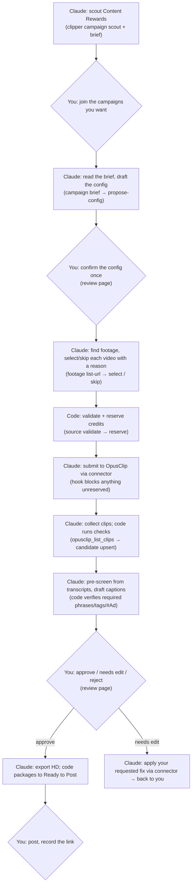

# Roadmap & Status

**Start here.** This page says where the project is going, how the whole process will work when it's done, and exactly where it stands today. It's the summary; the detail lives in the docs it links to.

*Last updated: 2026-09-23 · tasks 0–13 built and deployed; Discord notifications and R2 storage live and verified; live checks for 8 and 9 pending · operator runs are **manual only***

---

## 1. The goal

Automate short-form clipping for [Content Rewards](https://contentrewards.com/discover) campaigns using Claude and OpusClip. A person stays in charge of the few decisions that commit money or publish.

> Claude finds campaigns worth doing → reads each brief → finds the footage → OpusClip makes clips → Claude pre-screens them and drafts captions → **you approve** → **you post**.

## 2. The direction, and why

The first plan (Sept 17) was a conventional app: every step in code, footage assumed to be in a Google Drive folder, and the app calling an LLM to parse briefs. A survey of all 50 live campaigns (Sept 22, [`CAMPAIGN_SURVEY.md`](CAMPAIGN_SURVEY.md)) showed that doesn't fit reality:

- **Only ~60% of campaigns are "clip this footage" work** (31 of 50). The rest are UGC, music-audio or photo-slideshow campaigns that OpusClip can't do.
- **Footage is scattered:** Drive folders (20 campaigns), YouTube channels (7), Dropbox (4), Content Rewards uploads, Frame.io, and hosts OpusClip can't read (Kick, MediaSilo, custom portals).
- **The hard parts are judgment:** which of 8 subfolders is raw footage and which is logos or memes; which YouTube videos show the sponsor's merch; whether a caption follows the brief.

So the design became **code for guarantees, Claude for judgment, people for decisions** ([`ARCHITECTURE.md`](ARCHITECTURE.md)):

| Who | Does what | How |
|---|---|---|
| **Code** | Anything that must be exact or safe: the database, dedupe, credit budget, caption rule checks, the approval gate, the audit log | The `clipper` CLI + Postgres |
| **Claude** | Reading and deciding: scouting campaigns, turning briefs into configs, picking footage, pre-screening clips, drafting captions, triaging problems | A Claude Code session **you start** ("do an operator run"), following the playbook in [`.claude/skills/clipper-operator/`](../.claude/skills/clipper-operator/SKILL.md), acting only through the CLI and the **OpusClip connector** |
| **You** | Joining campaigns, confirming each campaign's config once, approving clips, posting | Content Rewards, and the review web page |

OpusClip is reached through its **connector** (MCP, Pro plan) from Claude's session rather than an API client in our code. The connector also gives Claude transcripts for pre-screening and tools to fix clips a reviewer sends back.

## 3. How the finished process will work

**Decided 2026-09-23: manual only.** Nothing runs on a schedule. An operator run happens only when you start one in a Claude Code session ("do an operator run"). Each run works through the loop above as far as it can and ends with a short report that starts with **what needs you**. There's no background worker, cron job or scheduled Claude Routine. OpusClip takes minutes to hours per video, so a run that submits footage can't collect the clips in the same go: start another run later to collect them. Nothing moves between runs except what you do on the review page.

## 4. Safety rails (enforced in code, not left to Claude)

| Rail | How it's enforced | Status |
|---|---|---|
| Only a person can activate a campaign or approve, reject or edit a clip | `transition()` refuses those status changes unless the actor is `reviewer:<you>`; the review module refuses non-reviewers too; the only `reviewer:` actor comes from a signed-in web session; the CLI has no such commands | ✅ built + tested |
| Nothing gets approved without a compliant caption, or over a failed check without an explicit override | review module | ✅ built + tested |
| No OpusClip spend without a reservation | A hook checks every connector submit against an open reservation's exact parameters; anything else is blocked | ✅ built + tested end to end |
| Budget can't be overspent | Daily budget, per-campaign cap and OpusClip's remaining credits are checked under a DB lock | ✅ built + tested under concurrency |
| One OpusClip project per video | Unique `(campaign, video)` key + one open reservation per job + `clipper:<jobId>` titles for crash recovery | ✅ built + tested |
| No posting or sharing through OpusClip | Those connector tools are denied in `.claude/settings.json` | ✅ in force |
| Campaign rules can't be silently dropped | Strict config schema; `autoApprove` must be `false` | ✅ built + tested |
| Captions include every required phrase, tag and disclosure | `set-caption` validation | ✅ built + tested |
| Objective checks never claim a pass they can't verify | unknown aspect/duration, overlays, on-screen text → `manual_review_required` | ✅ built + tested |
| Only approved clips get packaged | `clipper package` needs `approved` *and* a `reviewer:` approval event on record | ✅ built + tested |
| Problems reach you, once | `attention notify` at the end of every operator run: one digest, each item once per status change, retried if delivery fails | ✅ built + tested (local webhook) |
| Everything is auditable | `status_events` for status changes, `audit_log` for other writes | ✅ built |

## 5. Where we are

### Build progress ([`BUILD_PLAN.md`](BUILD_PLAN.md))

| # | Task | Status |
|---|---|---|
| 0 | Project scaffold (TypeScript, Fastify, per-section config, `/health`) | ✅ |
| 1 | Database schema + migrations | ✅ |
| 2 | `campaign-connector`: Content Rewards page parsing | ✅ |
| 3 | Schema v2 + guarded `transition()` + config cleanup | ✅ |
| 4 | `clipper` CLI + campaign commands (scout, add, show, list, classify, flag) | ✅ |
| 5 | Brief reader (`campaign brief`, links kept inline) | ✅ |
| 6 | Campaign config schema + `propose-config` | ✅ |
| 7 | Footage sourcing (Drive folders, YouTube channels, select/skip) | ✅ |
| 8 | Credit ledger + submit protocol + guard hook | ✅ **live** 2026-09-24: Drive upload (496 MB in 92 s) → reserve → guarded submit → project `P3092415v0K3` recorded, 10 credits |
| 9 | Collect clips from OpusClip + objective checks (`candidate upsert`) | ✅ **live** 2026-09-24: 15 real clips upserted unchanged (fields `clip_id`, `duration_sec`, `preview_url`, `is_bonus`, `stage: COMPLETE`) |
| 10 | Caption validation + pre-screen + reviewer-requested edits | ✅ |
| 11 | Review web page (confirm configs, approve clips, record posts) | ✅ |
| 12 | Ready-to-Post packaging to R2 + notifications | ✅ code · notifications ✅ live · R2 bucket ✅ live and verified |
| 13 | Deploy: Render web (free) + Supabase Postgres (free) + on-demand operator runs | ✅ review page **live**; operator remote mode **live and verified from a cloud session**; Discord notifications **live and verified** 2026-09-23; manual empty-queue run done 2026-09-23 (report: "Needs you: nothing") |
| 14 | End to end on a real campaign, twice (idempotency) | ⏳ |

**Milestone A (Claude can read campaigns) is done.** Claude can scout, add, classify, read briefs, propose configs and choose footage, all through the CLI, with nothing spent.

**Milestone B (clips get made) is built; its live check is pending.** Reserve → submit → collect → check → pre-screen → caption → reviewer-requested edits all work against fixtures. What's left is one real 10-credit run. It's no longer blocked on code: the review page (task 11) can now activate a campaign, so it waits on you joining the campaign and OK'ing the credits (§7).

**Milestone C (review and packages) is built and live.** The review page (task 11) is live, and can also delete a campaign that has no posts so it can be re-added from scratch, and reject all of a campaign's waiting clips at once (2026-09-25); Claude can reject clips too, only when you ask (`clipper candidate reject`); notifications and Ready-to-Post packaging (task 12) are both live and verified — a real Discord webhook, and a real R2 bucket (`clipper-bundles`) confirmed with a put/signed-URL/delete smoke test.

### Milestones

| Milestone | Tasks | What it unlocks | Spends money? |
|---|---|---|---|
| **A. Claude can read campaigns** | 3–7 | Scout → brief → config → footage | No · ✅ done |
| **B. Clips get made** | 8–10 | Submit to OpusClip within budget, collect and pre-screen clips | OpusClip credits · built, live check pending |
| **C. Review and packages** | 11–12 | Your review page, clip bundles, notifications | Storage (small) · ✅ done |
| **D. Live** | 13–14 | Hosted, run on demand, proven on a real campaign | $0 on free tiers (Render web + Supabase); ~$7/mo if the review page should never sleep |

### Verified against the real world

- Content Rewards: the discover listing (50 campaigns) and individual campaign pages parse live.
- Google Docs briefs: read with every link kept, including links the plain-text export loses (PULP, Ryan Zofay).
- Google Drive: folders list without an API key (Nilo: 13 folders, 137 files; Charlie Berens: 2 full specials).
- YouTube: channels resolve to their latest uploads, with Shorts flagged.
- OpusClip: connector live on the Pro plan (900 credits/month, 10 concurrent projects). No credits spent yet.

### State of the working database (local dev)

| Campaign | State | Notes |
|---|---|---|
| MW4 (Call of Duty) | `pending_confirmation` | Real caption rules drafted. **Footage is on MediaSilo, which OpusClip can't read**, and the campaign is paused on Content Rewards. |
| Charlie Berens | `discovered`, classified long-form | Drive folder registered; one full special selected. **Best first real test.** |

The **live database (Supabase)** holds one campaign as of 2026-09-24: **Charlie Berens**, `active` (config confirmed by `reviewer:Daniel`). Its Drive folder is registered and both full specials are selected. The first submission as a Drive link was rejected (OpusClip doesn't accept Drive links), so the Drive upload step was built; with it, a 10-minute slice of *Neighborly* (job `547c34b5`) was uploaded and submitted on 2026-09-24 as OpusClip project `P3092415v0K3` (10 credits, captions on). *Midwest Goodbye* is held until that test is judged. On 2026-09-26 that project was deleted in OpusClip (its clips carried the MW4 logo and were all rejected); the next Charlie Berens submission uses the clean `Default-Template`.

## 6. What's next

1. **First real test (closes out tasks 8, 9 and 12), once you've done the §7 items.**
   1. ✅ An operator run added Charlie Berens to the live database and onboarded it (2026-09-23) → `pending_confirmation`.
   2. ✅ Config confirmed on the review page (2026-09-24). You can now edit a live campaign's config there too: turn on `captionsEnabled` and `originalAudioOnly` (recommended) before the retry.
   3. ✅ A run re-queued the *Neighborly* job, uploaded it to OpusClip and submitted a 10-minute slice (10 credits, 2026-09-24). ✅ The next run collected 15 clips and pre-screened them (7 recommend, 5 hold, 3 reject) with caption drafts. Done: a run collects the clips (`candidate upsert`), pre-screens them and drafts captions.
   4. You approve a clip. The next run you start exports it and runs `clipper package`, and you get the bundle link.

   On the first upsert, check the real `opusclip_list_clips` field names and stage values against the parser (`src/modules/candidates/opusclip.ts`), and narrow it to what OpusClip actually sends.
2. **Task 14:** end to end on a real campaign, twice, checking nothing duplicates.

## 7. Decisions and inputs needed from you

| When | What |
|---|---|
| ~~Before the first real test~~ | ✅ done 2026-09-24: joined the Charlie Berens campaign and OK'd ~10 credits for a 10-minute slice |
| ~~Now~~ | ✅ done 2026-09-26: the OpusClip account now has one template, `Default-Template` (default, portrait, karaoke captions, no logo); `Preset template 1` and `MW4` were removed. The first-batch Charlie Berens project (`P3092415v0K3`, MW4 logo on every clip) was deleted in OpusClip the same day; its 15 clips were already rejected, so none will be exported. |
| ~~Before the first real test~~ | ✅ done 2026-09-23: a Cloudflare R2 bucket (`clipper-bundles`) with a bucket-scoped Account API token is set on Render (`R2_ACCOUNT_ID`, `R2_ACCESS_KEY_ID`, `R2_SECRET_ACCESS_KEY`, `R2_BUCKET_NAME`), verified with a live put/signed-URL/delete test. |
| ~~Before running the operator from a cloud session~~ | ✅ done 2026-09-23: `CLIPPER_OPERATOR_TOKEN` is in the Claude cloud environment (checked with a live `clipper attention list`). |
| ~~A Slack or Discord incoming-webhook URL~~ | ✅ done 2026-09-23: a Discord webhook is set as `NOTIFY_WEBHOOK_URL` on Render (`clipper-review`), verified with a live `clipper notify` test message delivered to Discord. |
| About once a week | Start any operator run, or open the review page, so the free Supabase database doesn't pause after ~7 idle days. If it does pause, restore it from the Supabase dashboard. |

**Decided:** only campaigns that **don't require a logo, watermark or overlay** are taken on (2026-09-25): those need an OpusClip brand template, which can only be edited on a desktop, and the pipeline is run from a phone. Scouting skips them, onboarding flags them, and the config validator rejects any overlay requirement. Every decision handed to you comes with Claude's recommendation (what usually performs best), and every notification links the review page (2026-09-24). Operator runs are **manual only**: no scheduled Routine (2026-09-23). Daily OpusClip budget **120 credits** (≈2 h of footage/day; set on Render as `OPUSCLIP_DAILY_CREDIT_BUDGET`, 2026-09-23). The month's 900 credits could go in ~7 days at that rate; the reserve step also refuses anything over OpusClip's remaining monthly credits.

## 8. Known limits (v1)

- **OpusClip can't ingest** Kick, MediaSilo, Notion pages or custom portals. Those campaigns need a person to supply footage, or get skipped.
- **Dropbox folders can't be listed** (the page renders in the browser). A person pastes direct file links.
- **YouTube channels** show only the 15 most recent uploads (feed limit).
- **Drive videos are copied into OpusClip** (`source upload`), because OpusClip refuses Drive links. It runs on the Render web service: a ~500 MB special takes a few minutes, and every upload counts against Render's free outbound bandwidth (100 GB/month).
- **Video length is unknown** before submitting, so credits are held at a 90-minute estimate unless a range or length is given. `credits reconcile` corrects the ledger from OpusClip's real usage.
- **No automated posting.** It's out of scope for v1 by design.
- **OpusClip brand templates are made by hand.** The API can only list them. The account's **default template is kept clean** (no logo) and serves every campaign; campaigns that require a logo aren't taken on. The default used to carry the MW4 logo, which put it on the first Charlie Berens clips (2026-09-24). Since 2026-09-26 the only template is `Default-Template` (`cmu2pvwct0456z090u3hcdq02`).
- **OpusClip returns a `_bonus` copy of its top clip** (same content, `is_bonus: true`). It comes in as its own candidate; pre-screen holds it as a duplicate.
- **Free hosting sleeps.** The review page (Render free) takes ~30–60 s to wake after idling, and a Supabase free project pauses after ~7 days without activity. With manual-only runs, nothing keeps it awake: use it at least weekly, or restore it from the dashboard.
- **Manual only means nothing moves on its own.** Clips OpusClip finishes, and clips you approve, wait until you start the next operator run.
- **One shared reviewer token.** The review page signs in with a name + `REVIEWER_TOKEN`, so the name is self-declared. Per-person accounts are a Phase 2 item.
- **Disclosures always go on their own line.** The config has no per-campaign switch; every `disclosureLines` entry must be a line of its own.

## 9. Where to read more

| Doc | For |
|---|---|
| [`README.md`](../README.md) | Product spec and local setup |
| [`CAMPAIGN_SURVEY.md`](CAMPAIGN_SURVEY.md) | The 50-campaign evidence behind the design |
| [`ARCHITECTURE.md`](ARCHITECTURE.md) | The split, guardrails, CLI contract, footage kinds, OpusClip protocol |
| [`BUILD_PLAN.md`](BUILD_PLAN.md) | Every task with its "done when" check and outcome |
| [`DATA_MODEL.md`](DATA_MODEL.md) | Database schema and `transition()` rules |
| [`API_CONTRACTS.md`](API_CONTRACTS.md) | Content Rewards, Google, YouTube, OpusClip connector details |
| [`DEPLOYMENT.md`](DEPLOYMENT.md) | Render + Supabase setup, and running the operator |
| [`.claude/skills/clipper-operator/`](../.claude/skills/clipper-operator/SKILL.md) | The playbook Claude follows |
